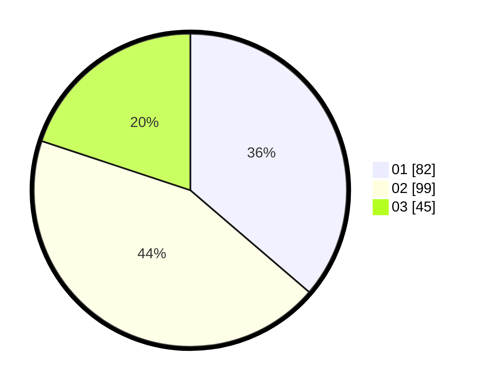

# Hasil

Hasil perolehan suara paslon dapat dilihat pada file paslon-01.txt, paslon-02.txt, dan paslon-03.txt.

Jika tidak ada, artinya data tersebut belum ada pada SIREKAP.

## Perolehan Suara

 * Paslon 01: **82**.
 * Paslon 02: **99**.
 * Paslon 03: **45**.

## Foto C Plano

https://sirekap-obj-formc.kpu.go.id/e765/pemilu/ppwp/31/71/03/10/03/3171031003051-20240216-142337--4bcdfea7-d961-48f0-ab2e-e6e62e338f42.jpg

https://sirekap-obj-formc.kpu.go.id/e765/pemilu/ppwp/31/71/03/10/03/3171031003051-20240216-142338--940de7e3-786e-4fb3-af85-20b91942b3ac.jpg

https://sirekap-obj-formc.kpu.go.id/e765/pemilu/ppwp/31/71/03/10/03/3171031003051-20240216-142337--4c541bb6-9602-465c-ab18-2849269db256.jpg

## DATA PEMILIH TETAP

Jumlah pemilih dalam DPT: **266**.
 * L: **124**.
 * P: **142**.

## DATA PENGGUNA HAK PILIH

Jumlah pengguna hak pilih dalam DPT: **230**.
 * L: **105**.
 * P: **127**.

Jumlah pengguna hak pilih dalam DPTb: **0**.
 * L: **0**.
 * P: **0**.

Jumlah pengguna hak pilih dalam DPK: **2**.
 * L: **1**.
 * P: **1**.

Jumlah pengguna hak pilih: **232**.
 * L: **106**.
 * P: **128**.

## JUMLAH SUARA SAH DAN TIDAK SAH

JUMLAH SELURUH SUARA SAH: **226**.

JUMLAH SUARA TIDAK SAH: **6**.

JUMLAH SELURUH SUARA SAH DAN SUARA TIDAK SAH: **232**.
