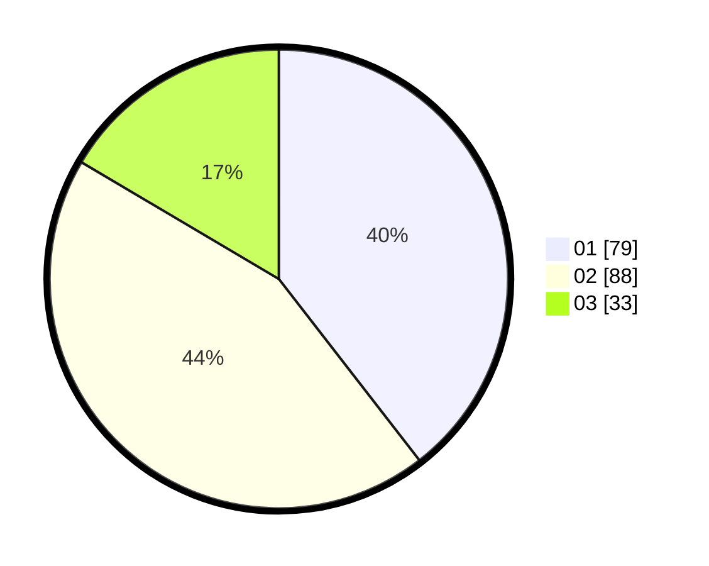

# Hasil

Hasil perolehan suara paslon dapat dilihat pada file paslon-01.txt, paslon-02.txt, dan paslon-03.txt.

Jika tidak ada, artinya data tersebut belum ada pada SIREKAP.

## Perolehan Suara

 * Paslon 01: **79**.
 * Paslon 02: **88**.
 * Paslon 03: **33**.

## Foto C Plano

https://sirekap-obj-formc.kpu.go.id/63a9/pemilu/ppwp/31/71/03/10/03/3171031003052-20240215-135055--1ed422a1-688b-4892-a706-56359a9ae360.jpg

https://sirekap-obj-formc.kpu.go.id/63a9/pemilu/ppwp/31/71/03/10/03/3171031003052-20240215-135105--5f3dc827-17da-4a4e-8a80-afba395c9c5d.jpg

https://sirekap-obj-formc.kpu.go.id/63a9/pemilu/ppwp/31/71/03/10/03/3171031003052-20240215-140017--532f9630-afd4-4553-ac0a-0cf6862a5afb.jpg

## DATA PEMILIH TETAP

Jumlah pemilih dalam DPT: **266**.
 * L: **134**.
 * P: **132**.

## DATA PENGGUNA HAK PILIH

Jumlah pengguna hak pilih dalam DPT: **192**.
 * L: **89**.
 * P: **103**.

Jumlah pengguna hak pilih dalam DPTb: **7**.
 * L: **3**.
 * P: **4**.

Jumlah pengguna hak pilih dalam DPK: **6**.
 * L: **0**.
 * P: **6**.

Jumlah pengguna hak pilih: **205**.
 * L: **92**.
 * P: **113**.

## JUMLAH SUARA SAH DAN TIDAK SAH

JUMLAH SELURUH SUARA SAH: **200**.

JUMLAH SUARA TIDAK SAH: **5**.

JUMLAH SELURUH SUARA SAH DAN SUARA TIDAK SAH: **205**.
