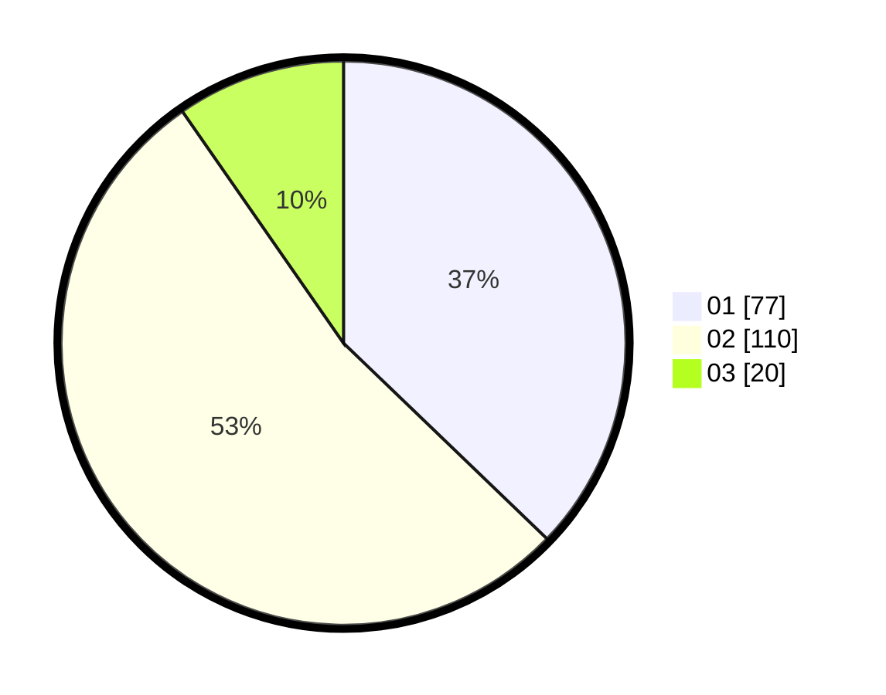

# Hasil

Hasil perolehan suara paslon dapat dilihat pada file paslon-01.txt, paslon-02.txt, dan paslon-03.txt.

Jika tidak ada, artinya data tersebut belum ada pada SIREKAP.

## Perolehan Suara

 * Paslon 01: **77**.
 * Paslon 02: **110**.
 * Paslon 03: **20**.

## Foto C Plano

https://sirekap-obj-formc.kpu.go.id/7e8d/pemilu/ppwp/31/71/03/10/03/3171031003059-20240217-111248--108886b6-680c-4599-9979-59fc401c041c.jpg

https://sirekap-obj-formc.kpu.go.id/7e8d/pemilu/ppwp/31/71/03/10/03/3171031003059-20240217-111714--d87d33d1-a78f-49f6-948e-43c439cf8d98.jpg

https://sirekap-obj-formc.kpu.go.id/7e8d/pemilu/ppwp/31/71/03/10/03/3171031003059-20240217-112255--71484a89-f37c-4f20-a018-740c4ac2eb47.jpg

## DATA PEMILIH TETAP

Jumlah pemilih dalam DPT: **271**.
 * L: **136**.
 * P: **135**.

## DATA PENGGUNA HAK PILIH

Jumlah pengguna hak pilih dalam DPT: **201**.
 * L: **93**.
 * P: **108**.

Jumlah pengguna hak pilih dalam DPTb: **6**.
 * L: **5**.
 * P: **1**.

Jumlah pengguna hak pilih dalam DPK: **2**.
 * L: **2**.
 * P: **0**.

Jumlah pengguna hak pilih: **209**.
 * L: **100**.
 * P: **109**.

## JUMLAH SUARA SAH DAN TIDAK SAH

JUMLAH SELURUH SUARA SAH: **207**.

JUMLAH SUARA TIDAK SAH: **2**.

JUMLAH SELURUH SUARA SAH DAN SUARA TIDAK SAH: **209**.
