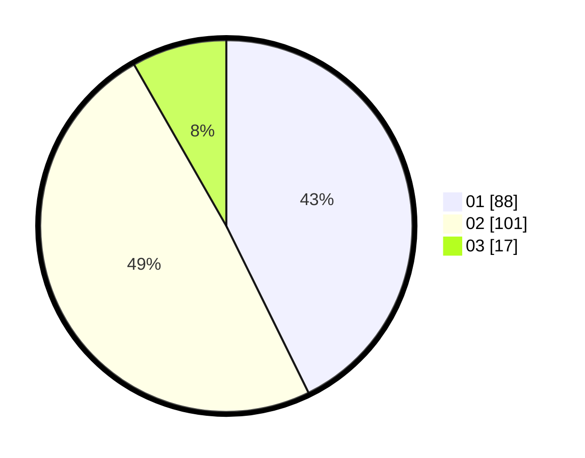

# Hasil

Hasil perolehan suara paslon dapat dilihat pada file paslon-01.txt, paslon-02.txt, dan paslon-03.txt.

Jika tidak ada, artinya data tersebut belum ada pada SIREKAP.

## Perolehan Suara

 * Paslon 01: **88**.
 * Paslon 02: **101**.
 * Paslon 03: **17**.

## Foto C Plano

https://sirekap-obj-formc.kpu.go.id/d4a8/pemilu/ppwp/31/71/03/10/03/3171031003060-20240214-190004--ab8fd0e9-0933-4afe-823b-07ab12864b0a.jpg

https://sirekap-obj-formc.kpu.go.id/d4a8/pemilu/ppwp/31/71/03/10/03/3171031003060-20240214-184525--076335c6-3e1a-48f2-88c7-b38d7496469d.jpg

https://sirekap-obj-formc.kpu.go.id/d4a8/pemilu/ppwp/31/71/03/10/03/3171031003060-20240214-190334--66b4ae96-ce45-47b9-ae87-1f2c8d6073cb.jpg

## DATA PEMILIH TETAP

Jumlah pemilih dalam DPT: **262**.
 * L: **131**.
 * P: **131**.

## DATA PENGGUNA HAK PILIH

Jumlah pengguna hak pilih dalam DPT: **207**.
 * L: **100**.
 * P: **107**.

Jumlah pengguna hak pilih dalam DPTb: **2**.
 * L: **1**.
 * P: **1**.

Jumlah pengguna hak pilih dalam DPK: **2**.
 * L: **1**.
 * P: **1**.

Jumlah pengguna hak pilih: **211**.
 * L: **102**.
 * P: **109**.

## JUMLAH SUARA SAH DAN TIDAK SAH

JUMLAH SELURUH SUARA SAH: **206**.

JUMLAH SUARA TIDAK SAH: **5**.

JUMLAH SELURUH SUARA SAH DAN SUARA TIDAK SAH: **211**.
