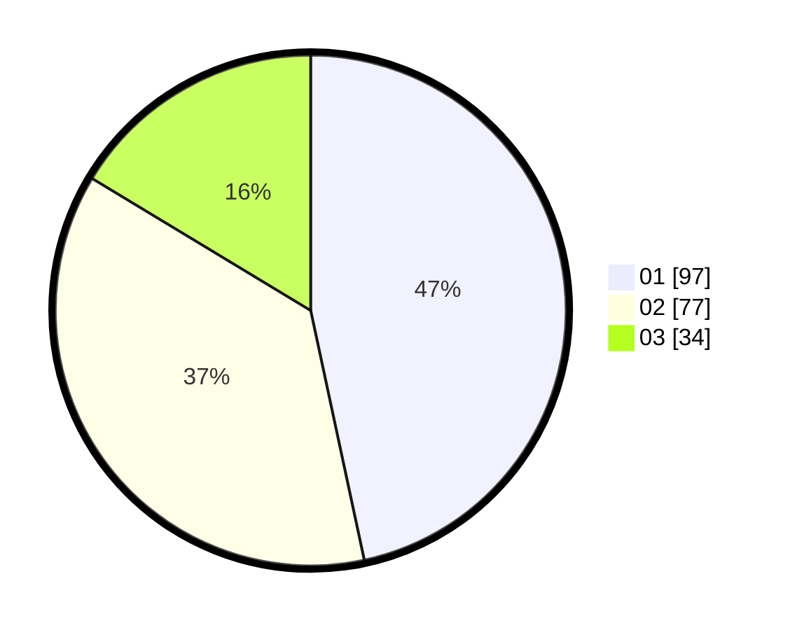

# Hasil

Hasil perolehan suara paslon dapat dilihat pada file paslon-01.txt, paslon-02.txt, dan paslon-03.txt.

Jika tidak ada, artinya data tersebut belum ada pada SIREKAP.

## Perolehan Suara

 * Paslon 01: **97**.
 * Paslon 02: **77**.
 * Paslon 03: **34**.

## Foto C Plano

https://sirekap-obj-formc.kpu.go.id/fa20/pemilu/ppwp/31/71/03/10/03/3171031003061-20240218-074602--7d89dd86-8f6e-44b8-9d60-6fa11b9b4d3e.jpg

https://sirekap-obj-formc.kpu.go.id/fa20/pemilu/ppwp/31/71/03/10/03/3171031003061-20240218-074705--4f9ab069-d045-48c6-a8aa-34df516d01e8.jpg

https://sirekap-obj-formc.kpu.go.id/fa20/pemilu/ppwp/31/71/03/10/03/3171031003061-20240218-074807--ce150dc1-915b-43b9-a9bf-2c8bab327b0f.jpg

## DATA PEMILIH TETAP

Jumlah pemilih dalam DPT: **266**.
 * L: **132**.
 * P: **134**.

## DATA PENGGUNA HAK PILIH

Jumlah pengguna hak pilih dalam DPT: **207**.
 * L: **103**.
 * P: **104**.

Jumlah pengguna hak pilih dalam DPTb: **0**.
 * L: **0**.
 * P: **0**.

Jumlah pengguna hak pilih dalam DPK: **3**.
 * L: **3**.
 * P: **0**.

Jumlah pengguna hak pilih: **210**.
 * L: **106**.
 * P: **104**.

## JUMLAH SUARA SAH DAN TIDAK SAH

JUMLAH SELURUH SUARA SAH: **208**.

JUMLAH SUARA TIDAK SAH: **2**.

JUMLAH SELURUH SUARA SAH DAN SUARA TIDAK SAH: **210**.
