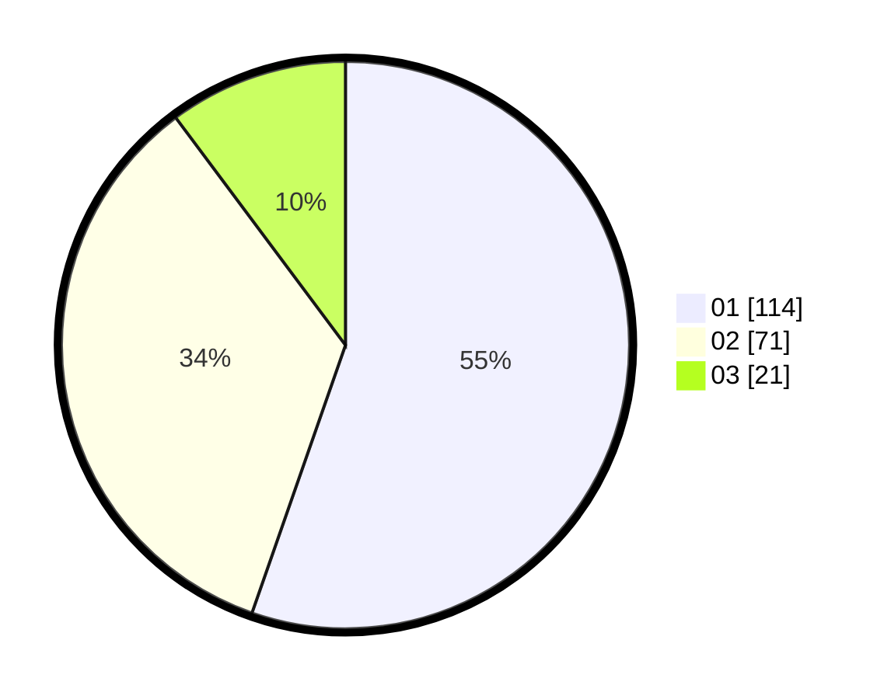

# Hasil

Hasil perolehan suara paslon dapat dilihat pada file paslon-01.txt, paslon-02.txt, dan paslon-03.txt.

Jika tidak ada, artinya data tersebut belum ada pada SIREKAP.

## Perolehan Suara

 * Paslon 01: **114**.
 * Paslon 02: **71**.
 * Paslon 03: **21**.

## Foto C Plano

https://sirekap-obj-formc.kpu.go.id/cc31/pemilu/ppwp/31/71/03/10/03/3171031003062-20240217-124856--0c8e9b64-ab6f-4b9d-8f27-f9c666decd73.jpg

https://sirekap-obj-formc.kpu.go.id/cc31/pemilu/ppwp/31/71/03/10/03/3171031003062-20240217-125002--27183eee-5bc8-4287-bed0-84a1ffd9070b.jpg

https://sirekap-obj-formc.kpu.go.id/cc31/pemilu/ppwp/31/71/03/10/03/3171031003062-20240217-125405--347872dd-cada-4acb-afe4-24a9ea0a6f3c.jpg
