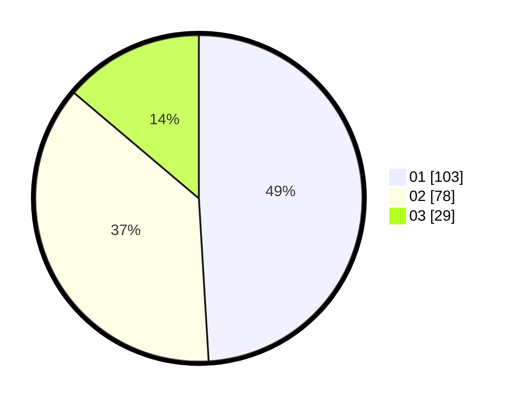

# Hasil

Hasil perolehan suara paslon dapat dilihat pada file paslon-01.txt, paslon-02.txt, dan paslon-03.txt.

Jika tidak ada, artinya data tersebut belum ada pada SIREKAP.

## Perolehan Suara

 * Paslon 01: **103**.
 * Paslon 02: **78**.
 * Paslon 03: **29**.

## Foto C Plano

https://sirekap-obj-formc.kpu.go.id/ea56/pemilu/ppwp/31/71/03/10/03/3171031003066-20240214-155449--01694a13-038f-4998-b171-6b5ec36db1a8.jpg

https://sirekap-obj-formc.kpu.go.id/ea56/pemilu/ppwp/31/71/03/10/03/3171031003066-20240214-190738--e271155a-e319-424e-93f3-f349cac073af.jpg

https://sirekap-obj-formc.kpu.go.id/ea56/pemilu/ppwp/31/71/03/10/03/3171031003066-20240214-190812--c34db5eb-b675-4749-b667-ac03d04b1659.jpg

## DATA PEMILIH TETAP

Jumlah pemilih dalam DPT: **289**.
 * L: **143**.
 * P: **146**.

## DATA PENGGUNA HAK PILIH

Jumlah pengguna hak pilih dalam DPT: **215**.
 * L: **98**.
 * P: **117**.

Jumlah pengguna hak pilih dalam DPTb: **0**.
 * L: **0**.
 * P: **0**.

Jumlah pengguna hak pilih dalam DPK: **3**.
 * L: **1**.
 * P: **2**.

Jumlah pengguna hak pilih: **218**.
 * L: **99**.
 * P: **119**.

## JUMLAH SUARA SAH DAN TIDAK SAH

JUMLAH SELURUH SUARA SAH: **210**.

JUMLAH SUARA TIDAK SAH: **8**.

JUMLAH SELURUH SUARA SAH DAN SUARA TIDAK SAH: **218**.
