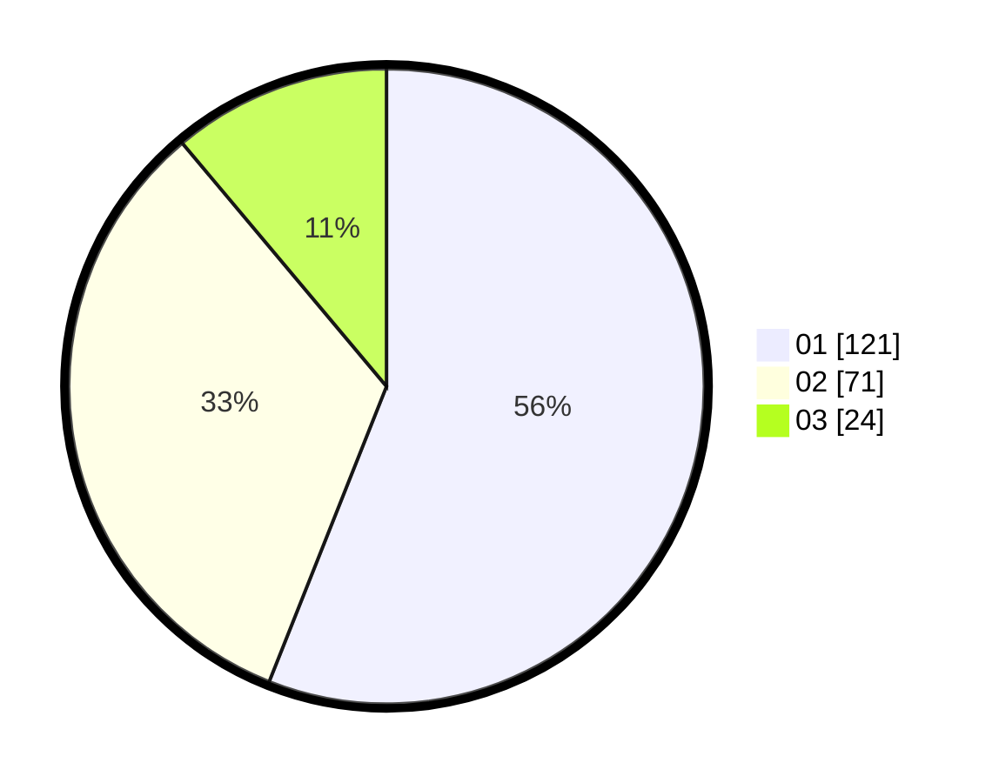

# Hasil

Hasil perolehan suara paslon dapat dilihat pada file paslon-01.txt, paslon-02.txt, dan paslon-03.txt.

Jika tidak ada, artinya data tersebut belum ada pada SIREKAP.

## Perolehan Suara

 * Paslon 01: **121**.
 * Paslon 02: **71**.
 * Paslon 03: **24**.

## Foto C Plano

https://sirekap-obj-formc.kpu.go.id/f4b6/pemilu/ppwp/31/71/03/10/03/3171031003067-20240214-155502--96616092-5141-446a-a6eb-f93c4d8b4c1b.jpg

https://sirekap-obj-formc.kpu.go.id/f4b6/pemilu/ppwp/31/71/03/10/03/3171031003067-20240214-162238--f72d9883-a302-472c-bddd-12db7aa6a8ba.jpg

https://sirekap-obj-formc.kpu.go.id/f4b6/pemilu/ppwp/31/71/03/10/03/3171031003067-20240214-185241--867fd53d-07bd-4a64-ac2e-f76e6590ba03.jpg

## DATA PEMILIH TETAP

Jumlah pemilih dalam DPT: **288**.
 * L: **137**.
 * P: **151**.

## DATA PENGGUNA HAK PILIH

Jumlah pengguna hak pilih dalam DPT: **212**.
 * L: **93**.
 * P: **119**.

Jumlah pengguna hak pilih dalam DPTb: **4**.
 * L: **4**.
 * P: **0**.

Jumlah pengguna hak pilih dalam DPK: **0**.
 * L: **0**.
 * P: **0**.

Jumlah pengguna hak pilih: **216**.
 * L: **97**.
 * P: **119**.

## JUMLAH SUARA SAH DAN TIDAK SAH

JUMLAH SELURUH SUARA SAH: **216**.

JUMLAH SUARA TIDAK SAH: **0**.

JUMLAH SELURUH SUARA SAH DAN SUARA TIDAK SAH: **216**.
