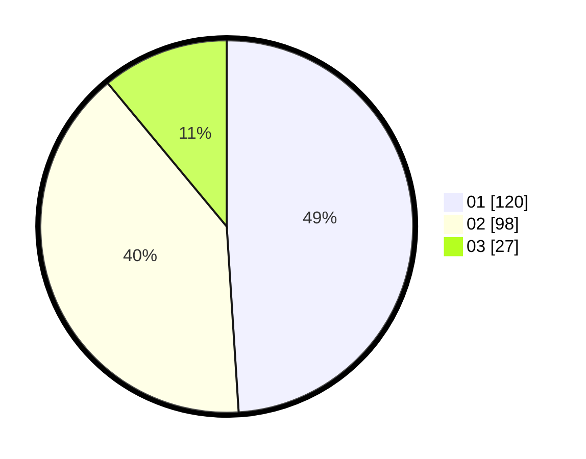

# Hasil

Hasil perolehan suara paslon dapat dilihat pada file paslon-01.txt, paslon-02.txt, dan paslon-03.txt.

Jika tidak ada, artinya data tersebut belum ada pada SIREKAP.

## Perolehan Suara

 * Paslon 01: **120**.
 * Paslon 02: **98**.
 * Paslon 03: **27**.

## Foto C Plano

https://sirekap-obj-formc.kpu.go.id/9901/pemilu/ppwp/31/71/03/10/03/3171031003068-20240216-020346--7fe94a73-2d79-41a0-97da-bb7c24e17a56.jpg

https://sirekap-obj-formc.kpu.go.id/9901/pemilu/ppwp/31/71/03/10/03/3171031003068-20240216-014933--b461fbfb-94de-417f-955b-f5787bcd3adc.jpg

https://sirekap-obj-formc.kpu.go.id/9901/pemilu/ppwp/31/71/03/10/03/3171031003068-20240216-014926--79d1666f-8369-4b97-9f66-2b3b69dcc7b4.jpg

## DATA PEMILIH TETAP

Jumlah pemilih dalam DPT: **294**.
 * L: **140**.
 * P: **154**.

## DATA PENGGUNA HAK PILIH

Jumlah pengguna hak pilih dalam DPT: **245**.
 * L: **109**.
 * P: **136**.

Jumlah pengguna hak pilih dalam DPTb: **4**.
 * L: **2**.
 * P: **2**.

Jumlah pengguna hak pilih dalam DPK: **0**.
 * L: **0**.
 * P: **0**.

Jumlah pengguna hak pilih: **249**.
 * L: **111**.
 * P: **138**.

## JUMLAH SUARA SAH DAN TIDAK SAH

JUMLAH SELURUH SUARA SAH: **245**.

JUMLAH SUARA TIDAK SAH: **4**.

JUMLAH SELURUH SUARA SAH DAN SUARA TIDAK SAH: **249**.
