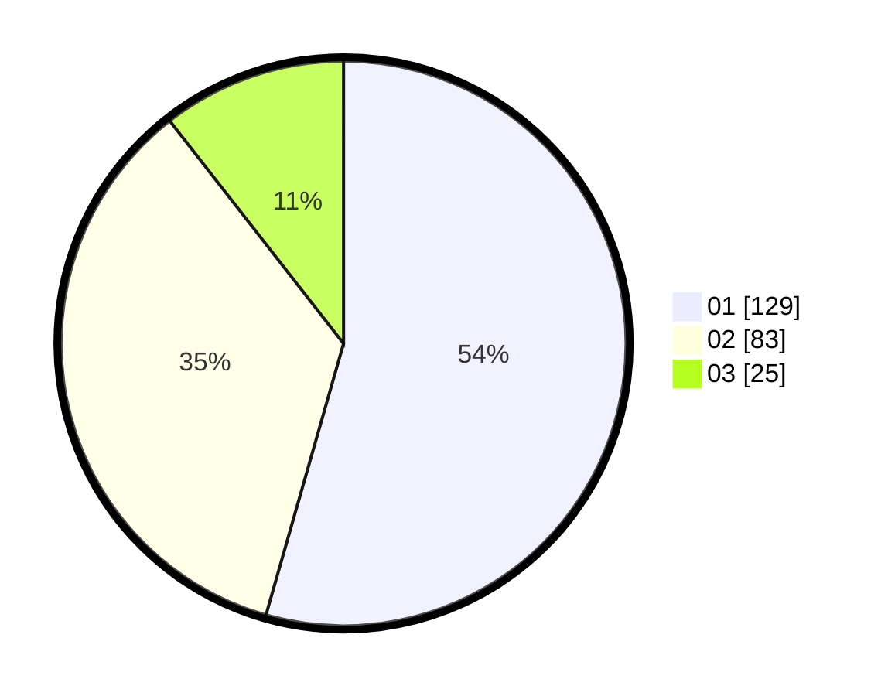

# Hasil

Hasil perolehan suara paslon dapat dilihat pada file paslon-01.txt, paslon-02.txt, dan paslon-03.txt.

Jika tidak ada, artinya data tersebut belum ada pada SIREKAP.

## Perolehan Suara

 * Paslon 01: **129**.
 * Paslon 02: **83**.
 * Paslon 03: **25**.

## Foto C Plano

https://sirekap-obj-formc.kpu.go.id/d0eb/pemilu/ppwp/31/71/03/10/03/3171031003070-20240214-162233--e2139699-33e7-4a40-a33d-62cda3ccb2e5.jpg

https://sirekap-obj-formc.kpu.go.id/d0eb/pemilu/ppwp/31/71/03/10/03/3171031003070-20240215-210624--3134ecfe-d257-421c-bfc5-77f2af5ebb6e.jpg

https://sirekap-obj-formc.kpu.go.id/d0eb/pemilu/ppwp/31/71/03/10/03/3171031003070-20240215-210623--af4605d6-d5e6-4705-8a6a-14668729771e.jpg

## DATA PEMILIH TETAP

Jumlah pemilih dalam DPT: **289**.
 * L: **149**.
 * P: **140**.

## DATA PENGGUNA HAK PILIH

Jumlah pengguna hak pilih dalam DPT: **236**.
 * L: **118**.
 * P: **118**.

Jumlah pengguna hak pilih dalam DPTb: **3**.
 * L: **1**.
 * P: **2**.

Jumlah pengguna hak pilih dalam DPK: **0**.
 * L: **0**.
 * P: **0**.

Jumlah pengguna hak pilih: **239**.
 * L: **119**.
 * P: **120**.

## JUMLAH SUARA SAH DAN TIDAK SAH

JUMLAH SELURUH SUARA SAH: **237**.

JUMLAH SUARA TIDAK SAH: **2**.

JUMLAH SELURUH SUARA SAH DAN SUARA TIDAK SAH: **239**.
