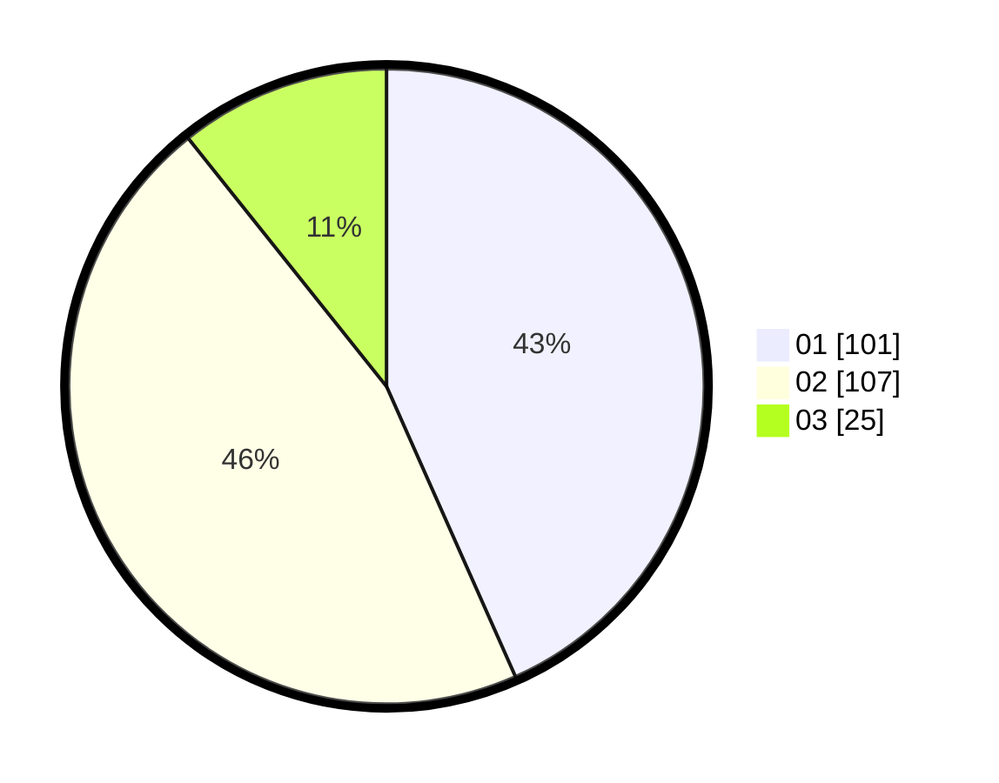

# Hasil

Hasil perolehan suara paslon dapat dilihat pada file paslon-01.txt, paslon-02.txt, dan paslon-03.txt.

Jika tidak ada, artinya data tersebut belum ada pada SIREKAP.

## Perolehan Suara

 * Paslon 01: **101**.
 * Paslon 02: **107**.
 * Paslon 03: **25**.

## Foto C Plano

https://sirekap-obj-formc.kpu.go.id/adfd/pemilu/ppwp/31/71/03/10/03/3171031003073-20240214-191110--2b1c6620-e141-4de5-8721-c5664d04e854.jpg

https://sirekap-obj-formc.kpu.go.id/adfd/pemilu/ppwp/31/71/03/10/03/3171031003073-20240214-191652--2e769412-73af-4b3d-89a2-1d4f606382b2.jpg

https://sirekap-obj-formc.kpu.go.id/adfd/pemilu/ppwp/31/71/03/10/03/3171031003073-20240214-191821--59df11b6-b01f-4697-a3da-a88beced0661.jpg

## DATA PEMILIH TETAP

Jumlah pemilih dalam DPT: **292**.
 * L: **147**.
 * P: **165**.

## DATA PENGGUNA HAK PILIH

Jumlah pengguna hak pilih dalam DPT: **236**.
 * L: **112**.
 * P: **124**.

Jumlah pengguna hak pilih dalam DPTb: **1**.
 * L: **1**.
 * P: **0**.

Jumlah pengguna hak pilih dalam DPK: **2**.
 * L: **1**.
 * P: **1**.

Jumlah pengguna hak pilih: **239**.
 * L: **114**.
 * P: **125**.

## JUMLAH SUARA SAH DAN TIDAK SAH

JUMLAH SELURUH SUARA SAH: **233**.

JUMLAH SUARA TIDAK SAH: **6**.

JUMLAH SELURUH SUARA SAH DAN SUARA TIDAK SAH: **239**.
