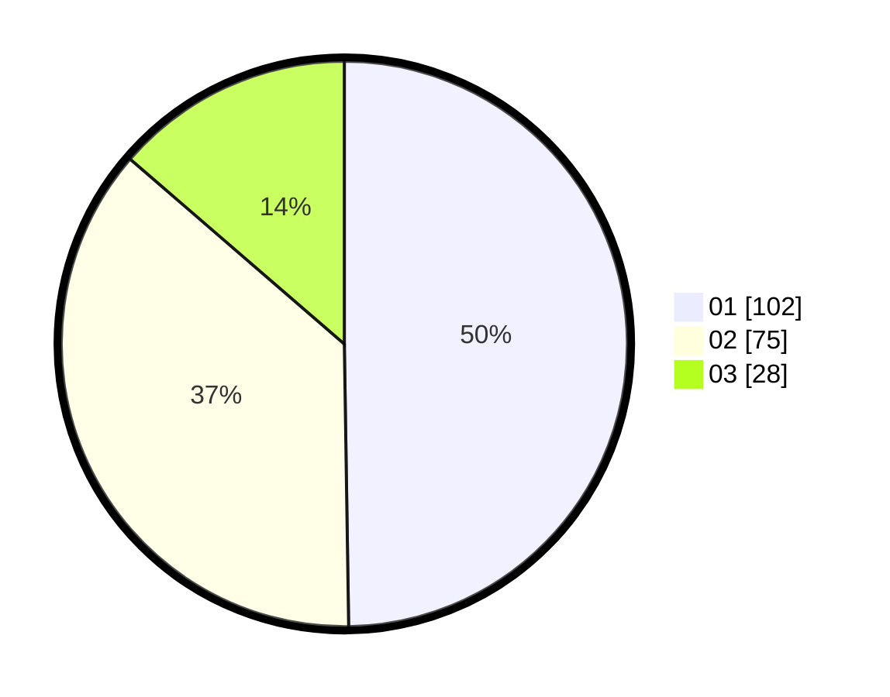

# Hasil

Hasil perolehan suara paslon dapat dilihat pada file paslon-01.txt, paslon-02.txt, dan paslon-03.txt.

Jika tidak ada, artinya data tersebut belum ada pada SIREKAP.

## Perolehan Suara

 * Paslon 01: **102**.
 * Paslon 02: **75**.
 * Paslon 03: **28**.

## Foto C Plano

https://sirekap-obj-formc.kpu.go.id/3d4d/pemilu/ppwp/31/71/03/10/04/3171031004002-20240214-224309--7b1e6b0c-c9ae-4444-9835-32b0c67c6e8c.jpg

https://sirekap-obj-formc.kpu.go.id/3d4d/pemilu/ppwp/31/71/03/10/04/3171031004002-20240214-224408--53c64b92-afab-4fe0-b9dd-6293fcb2eab6.jpg

https://sirekap-obj-formc.kpu.go.id/3d4d/pemilu/ppwp/31/71/03/10/04/3171031004002-20240214-224500--c5e7a2ab-082a-4159-827e-140a17e78a6f.jpg

## DATA PEMILIH TETAP

Jumlah pemilih dalam DPT: **264**.
 * L: **121**.
 * P: **143**.

## DATA PENGGUNA HAK PILIH

Jumlah pengguna hak pilih dalam DPT: **202**.
 * L: **93**.
 * P: **109**.

Jumlah pengguna hak pilih dalam DPTb: **2**.
 * L: **1**.
 * P: **1**.

Jumlah pengguna hak pilih dalam DPK: **1**.
 * L: **1**.
 * P: **0**.

Jumlah pengguna hak pilih: **205**.
 * L: **95**.
 * P: **110**.

## JUMLAH SUARA SAH DAN TIDAK SAH

JUMLAH SELURUH SUARA SAH: **205**.

JUMLAH SUARA TIDAK SAH: **0**.

JUMLAH SELURUH SUARA SAH DAN SUARA TIDAK SAH: **205**.
