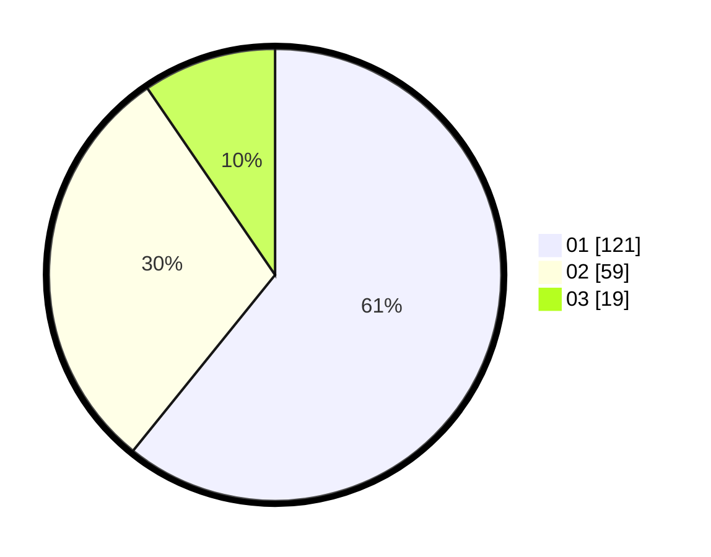

# Hasil

Hasil perolehan suara paslon dapat dilihat pada file paslon-01.txt, paslon-02.txt, dan paslon-03.txt.

Jika tidak ada, artinya data tersebut belum ada pada SIREKAP.

## Perolehan Suara

 * Paslon 01: **121**.
 * Paslon 02: **59**.
 * Paslon 03: **19**.

## Foto C Plano

https://sirekap-obj-formc.kpu.go.id/9275/pemilu/ppwp/31/71/03/10/04/3171031004004-20240214-190738--616ee025-5440-4ecb-baff-4e54b1a384d8.jpg

https://sirekap-obj-formc.kpu.go.id/9275/pemilu/ppwp/31/71/03/10/04/3171031004004-20240214-190800--515bca14-a9a4-4bc0-808e-f024df6d79f0.jpg

https://sirekap-obj-formc.kpu.go.id/9275/pemilu/ppwp/31/71/03/10/04/3171031004004-20240214-190749--6507d466-c3f8-4948-b7c0-f5ce593653ee.jpg

## DATA PEMILIH TETAP

Jumlah pemilih dalam DPT: **261**.
 * L: **125**.
 * P: **136**.

## DATA PENGGUNA HAK PILIH

Jumlah pengguna hak pilih dalam DPT: **201**.
 * L: **92**.
 * P: **109**.

Jumlah pengguna hak pilih dalam DPTb: **2**.
 * L: **1**.
 * P: **1**.

Jumlah pengguna hak pilih dalam DPK: **0**.
 * L: **0**.
 * P: **0**.

Jumlah pengguna hak pilih: **203**.
 * L: **93**.
 * P: **110**.

## JUMLAH SUARA SAH DAN TIDAK SAH

JUMLAH SELURUH SUARA SAH: **199**.

JUMLAH SUARA TIDAK SAH: **4**.

JUMLAH SELURUH SUARA SAH DAN SUARA TIDAK SAH: **203**.
