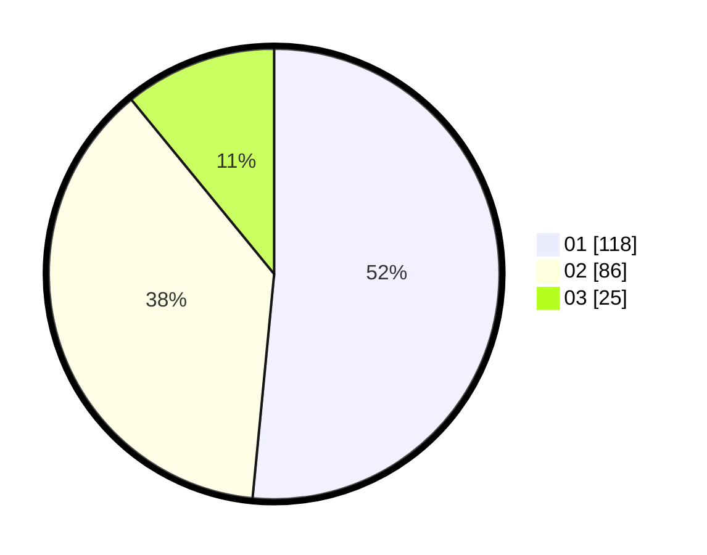

# Hasil

Hasil perolehan suara paslon dapat dilihat pada file paslon-01.txt, paslon-02.txt, dan paslon-03.txt.

Jika tidak ada, artinya data tersebut belum ada pada SIREKAP.

## Perolehan Suara

 * Paslon 01: **118**.
 * Paslon 02: **86**.
 * Paslon 03: **25**.

## Foto C Plano

https://sirekap-obj-formc.kpu.go.id/eb12/pemilu/ppwp/31/71/03/10/04/3171031004005-20240214-192254--1b7eaff2-c45a-4575-9b24-fef334a2cae1.jpg

https://sirekap-obj-formc.kpu.go.id/eb12/pemilu/ppwp/31/71/03/10/04/3171031004005-20240214-190455--ffa7072e-974f-4673-b561-df17da52cbfa.jpg

https://sirekap-obj-formc.kpu.go.id/eb12/pemilu/ppwp/31/71/03/10/04/3171031004005-20240214-192409--bdacad8e-0029-4e66-b01f-c101d43b3b5d.jpg

## DATA PEMILIH TETAP

Jumlah pemilih dalam DPT: **274**.
 * L: **132**.
 * P: **142**.

## DATA PENGGUNA HAK PILIH

Jumlah pengguna hak pilih dalam DPT: **228**.
 * L: **102**.
 * P: **126**.

Jumlah pengguna hak pilih dalam DPTb: **4**.
 * L: **3**.
 * P: **1**.

Jumlah pengguna hak pilih dalam DPK: **2**.
 * L: **1**.
 * P: **1**.

Jumlah pengguna hak pilih: **234**.
 * L: **106**.
 * P: **128**.

## JUMLAH SUARA SAH DAN TIDAK SAH

JUMLAH SELURUH SUARA SAH: **229**.

JUMLAH SUARA TIDAK SAH: **5**.

JUMLAH SELURUH SUARA SAH DAN SUARA TIDAK SAH: **234**.
