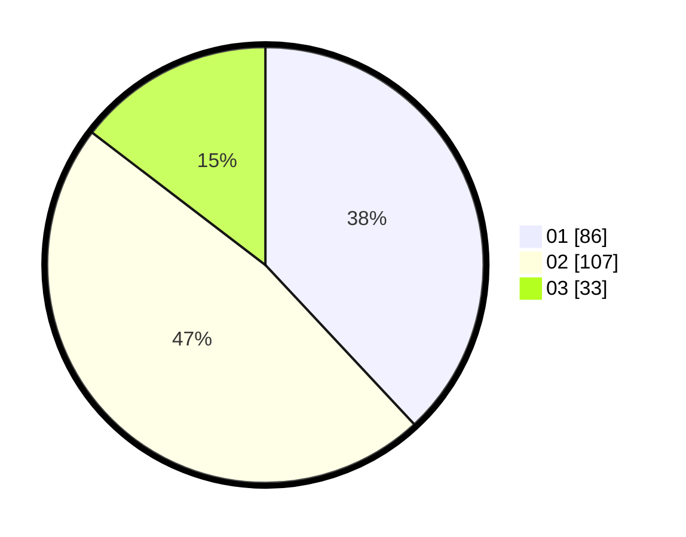

# Hasil

Hasil perolehan suara paslon dapat dilihat pada file paslon-01.txt, paslon-02.txt, dan paslon-03.txt.

Jika tidak ada, artinya data tersebut belum ada pada SIREKAP.

## Perolehan Suara

 * Paslon 01: **86**.
 * Paslon 02: **107**.
 * Paslon 03: **33**.

## Foto C Plano

https://sirekap-obj-formc.kpu.go.id/6d99/pemilu/ppwp/31/71/03/10/04/3171031004007-20240214-192811--b2bdd3fa-a3c2-4ad6-9688-3e19c05f89d2.jpg

https://sirekap-obj-formc.kpu.go.id/6d99/pemilu/ppwp/31/71/03/10/04/3171031004007-20240214-192927--33aca3ac-1f13-4d76-a8bd-334f3ac88a5c.jpg

https://sirekap-obj-formc.kpu.go.id/6d99/pemilu/ppwp/31/71/03/10/04/3171031004007-20240214-200924--e91f0e77-83f2-4098-af86-7d728253cbe1.jpg

## DATA PEMILIH TETAP

Jumlah pemilih dalam DPT: **281**.
 * L: **139**.
 * P: **142**.

## DATA PENGGUNA HAK PILIH

Jumlah pengguna hak pilih dalam DPT: **232**.
 * L: **112**.
 * P: **120**.

Jumlah pengguna hak pilih dalam DPTb: **3**.
 * L: **0**.
 * P: **3**.

Jumlah pengguna hak pilih dalam DPK: **0**.
 * L: **0**.
 * P: **0**.

Jumlah pengguna hak pilih: **235**.
 * L: **112**.
 * P: **123**.

## JUMLAH SUARA SAH DAN TIDAK SAH

JUMLAH SELURUH SUARA SAH: **226**.

JUMLAH SUARA TIDAK SAH: **9**.

JUMLAH SELURUH SUARA SAH DAN SUARA TIDAK SAH: **235**.
