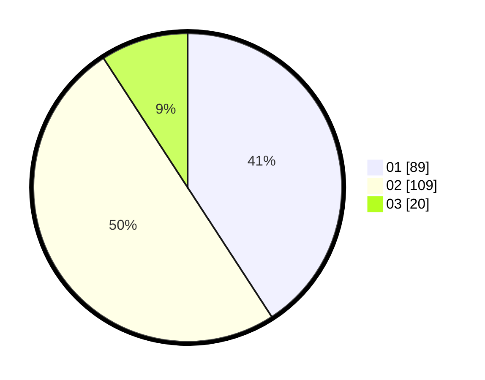

# Hasil

Hasil perolehan suara paslon dapat dilihat pada file paslon-01.txt, paslon-02.txt, dan paslon-03.txt.

Jika tidak ada, artinya data tersebut belum ada pada SIREKAP.

## Perolehan Suara

 * Paslon 01: **89**.
 * Paslon 02: **109**.
 * Paslon 03: **20**.

## Foto C Plano

https://sirekap-obj-formc.kpu.go.id/21a2/pemilu/ppwp/31/71/03/10/04/3171031004012-20240216-125145--7ad5bc9b-d3f3-4832-87ef-7e810e0e1ac2.jpg

https://sirekap-obj-formc.kpu.go.id/21a2/pemilu/ppwp/31/71/03/10/04/3171031004012-20240216-125151--a6e2b88b-4248-4af1-a94c-b65fe000c0e9.jpg

https://sirekap-obj-formc.kpu.go.id/21a2/pemilu/ppwp/31/71/03/10/04/3171031004012-20240216-125148--34e8359c-fab7-40d8-b650-953ac821ae07.jpg

## DATA PEMILIH TETAP

Jumlah pemilih dalam DPT: **273**.
 * L: **120**.
 * P: **153**.

## DATA PENGGUNA HAK PILIH

Jumlah pengguna hak pilih dalam DPT: **214**.
 * L: **96**.
 * P: **118**.

Jumlah pengguna hak pilih dalam DPTb: **5**.
 * L: **3**.
 * P: **2**.

Jumlah pengguna hak pilih dalam DPK: **1**.
 * L: **0**.
 * P: **1**.

Jumlah pengguna hak pilih: **220**.
 * L: **99**.
 * P: **121**.

## JUMLAH SUARA SAH DAN TIDAK SAH

JUMLAH SELURUH SUARA SAH: **218**.

JUMLAH SUARA TIDAK SAH: **2**.

JUMLAH SELURUH SUARA SAH DAN SUARA TIDAK SAH: **220**.
