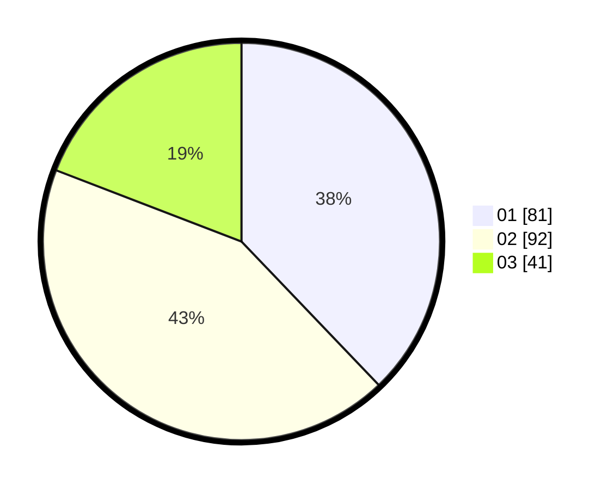

# Hasil

Hasil perolehan suara paslon dapat dilihat pada file paslon-01.txt, paslon-02.txt, dan paslon-03.txt.

Jika tidak ada, artinya data tersebut belum ada pada SIREKAP.

## Perolehan Suara

 * Paslon 01: **81**.
 * Paslon 02: **92**.
 * Paslon 03: **41**.

## Foto C Plano

https://sirekap-obj-formc.kpu.go.id/d96a/pemilu/ppwp/31/71/03/10/04/3171031004014-20240214-205740--71aac7ed-abc6-4143-bc37-1259dd7d0f60.jpg

https://sirekap-obj-formc.kpu.go.id/d96a/pemilu/ppwp/31/71/03/10/04/3171031004014-20240214-214713--bde9fbd7-c1ea-4dbc-b627-2b291edc4071.jpg

https://sirekap-obj-formc.kpu.go.id/d96a/pemilu/ppwp/31/71/03/10/04/3171031004014-20240214-210032--10c05a7e-8638-4868-baf4-4320b1640a51.jpg
