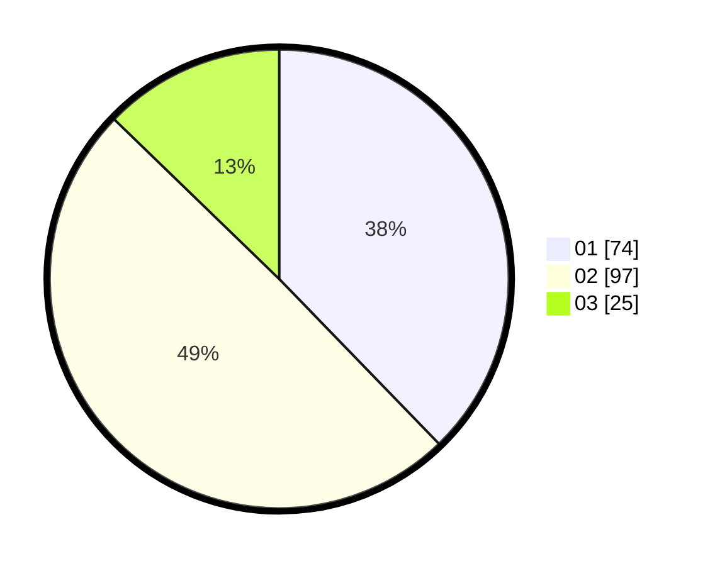

# Hasil

Hasil perolehan suara paslon dapat dilihat pada file paslon-01.txt, paslon-02.txt, dan paslon-03.txt.

Jika tidak ada, artinya data tersebut belum ada pada SIREKAP.

## Perolehan Suara

 * Paslon 01: **74**.
 * Paslon 02: **97**.
 * Paslon 03: **25**.

## Foto C Plano

https://sirekap-obj-formc.kpu.go.id/6e75/pemilu/ppwp/31/71/03/10/04/3171031004015-20240216-035121--8cbabbe3-1499-4c55-8488-cf650daf6493.jpg

https://sirekap-obj-formc.kpu.go.id/6e75/pemilu/ppwp/31/71/03/10/04/3171031004015-20240216-035134--5582fcbe-18d9-4c5e-a48f-ed121b2f66b5.jpg

https://sirekap-obj-formc.kpu.go.id/6e75/pemilu/ppwp/31/71/03/10/04/3171031004015-20240216-035130--ef832411-a7a7-4afb-9939-9cf88e13e2a4.jpg

## DATA PEMILIH TETAP

Jumlah pemilih dalam DPT: **277**.
 * L: **150**.
 * P: **127**.

## DATA PENGGUNA HAK PILIH

Jumlah pengguna hak pilih dalam DPT: **192**.
 * L: **102**.
 * P: **90**.

Jumlah pengguna hak pilih dalam DPTb: **2**.
 * L: **1**.
 * P: **1**.

Jumlah pengguna hak pilih dalam DPK: **2**.
 * L: **1**.
 * P: **1**.

Jumlah pengguna hak pilih: **196**.
 * L: **104**.
 * P: **92**.

## JUMLAH SUARA SAH DAN TIDAK SAH

JUMLAH SELURUH SUARA SAH: **196**.

JUMLAH SUARA TIDAK SAH: **0**.

JUMLAH SELURUH SUARA SAH DAN SUARA TIDAK SAH: **196**.
