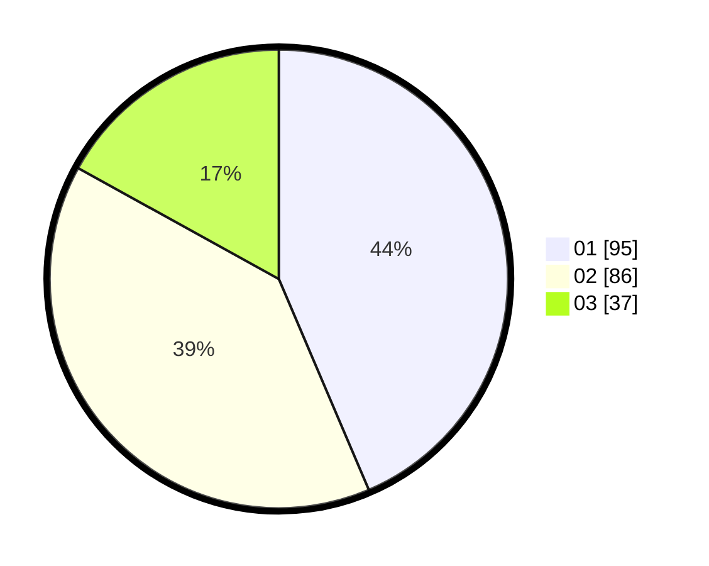

# Hasil

Hasil perolehan suara paslon dapat dilihat pada file paslon-01.txt, paslon-02.txt, dan paslon-03.txt.

Jika tidak ada, artinya data tersebut belum ada pada SIREKAP.

## Perolehan Suara

 * Paslon 01: **95**.
 * Paslon 02: **86**.
 * Paslon 03: **37**.

## Foto C Plano

https://sirekap-obj-formc.kpu.go.id/86d3/pemilu/ppwp/31/71/03/10/04/3171031004024-20240216-063822--fcbc9706-96ab-40fe-baa0-33b9ad3e45fa.jpg

https://sirekap-obj-formc.kpu.go.id/86d3/pemilu/ppwp/31/71/03/10/04/3171031004024-20240216-063840--83b7f5ba-3958-4578-96f7-77c45da8ad24.jpg

https://sirekap-obj-formc.kpu.go.id/86d3/pemilu/ppwp/31/71/03/10/04/3171031004024-20240216-063831--72a1c988-053b-45eb-8db8-7d2dba6bf228.jpg

## DATA PEMILIH TETAP

Jumlah pemilih dalam DPT: **275**.
 * L: **135**.
 * P: **140**.

## DATA PENGGUNA HAK PILIH

Jumlah pengguna hak pilih dalam DPT: **216**.
 * L: **102**.
 * P: **114**.

Jumlah pengguna hak pilih dalam DPTb: **1**.
 * L: **0**.
 * P: **1**.

Jumlah pengguna hak pilih dalam DPK: **4**.
 * L: **1**.
 * P: **3**.

Jumlah pengguna hak pilih: **221**.
 * L: **103**.
 * P: **118**.

## JUMLAH SUARA SAH DAN TIDAK SAH

JUMLAH SELURUH SUARA SAH: **218**.

JUMLAH SUARA TIDAK SAH: **3**.

JUMLAH SELURUH SUARA SAH DAN SUARA TIDAK SAH: **221**.
