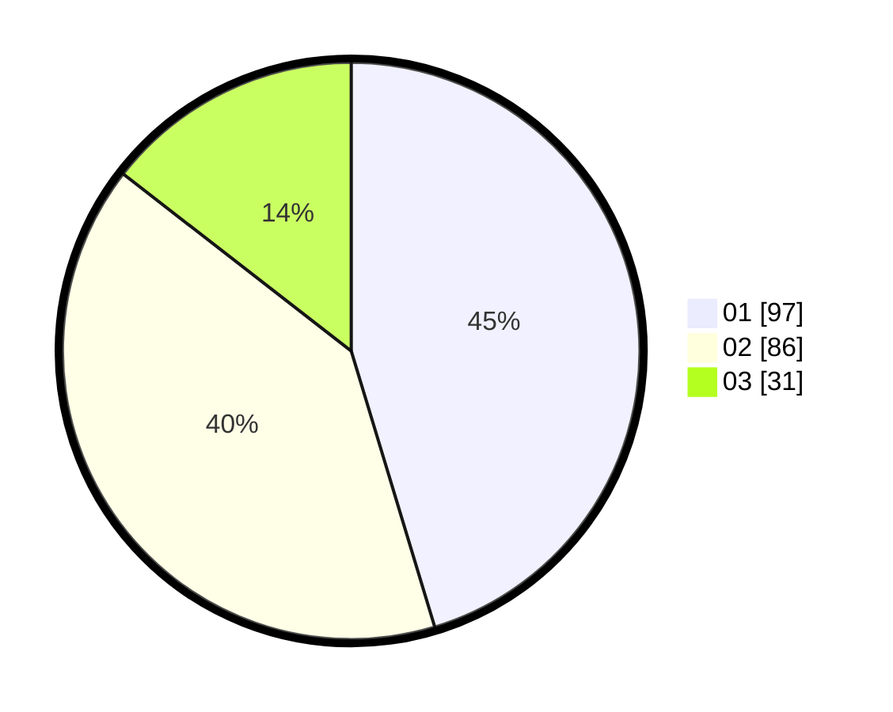

# Hasil

Hasil perolehan suara paslon dapat dilihat pada file paslon-01.txt, paslon-02.txt, dan paslon-03.txt.

Jika tidak ada, artinya data tersebut belum ada pada SIREKAP.

## Perolehan Suara

 * Paslon 01: **97**.
 * Paslon 02: **86**.
 * Paslon 03: **31**.

## Foto C Plano

https://sirekap-obj-formc.kpu.go.id/2ab1/pemilu/ppwp/31/71/03/10/04/3171031004026-20240214-191548--59c1aa73-7a49-41dd-ad92-2696abc004f5.jpg

https://sirekap-obj-formc.kpu.go.id/2ab1/pemilu/ppwp/31/71/03/10/04/3171031004026-20240214-194547--64796751-1565-4e15-8d1c-513915b21da0.jpg

https://sirekap-obj-formc.kpu.go.id/2ab1/pemilu/ppwp/31/71/03/10/04/3171031004026-20240214-194859--10849190-9460-4d9d-a87f-cb12e82ed393.jpg

## DATA PEMILIH TETAP

Jumlah pemilih dalam DPT: **271**.
 * L: **130**.
 * P: **141**.

## DATA PENGGUNA HAK PILIH

Jumlah pengguna hak pilih dalam DPT: **215**.
 * L: **98**.
 * P: **117**.

Jumlah pengguna hak pilih dalam DPTb: **1**.
 * L: **0**.
 * P: **1**.

Jumlah pengguna hak pilih dalam DPK: **2**.
 * L: **1**.
 * P: **1**.

Jumlah pengguna hak pilih: **218**.
 * L: **99**.
 * P: **119**.

## JUMLAH SUARA SAH DAN TIDAK SAH

JUMLAH SELURUH SUARA SAH: **214**.

JUMLAH SUARA TIDAK SAH: **4**.

JUMLAH SELURUH SUARA SAH DAN SUARA TIDAK SAH: **218**.
