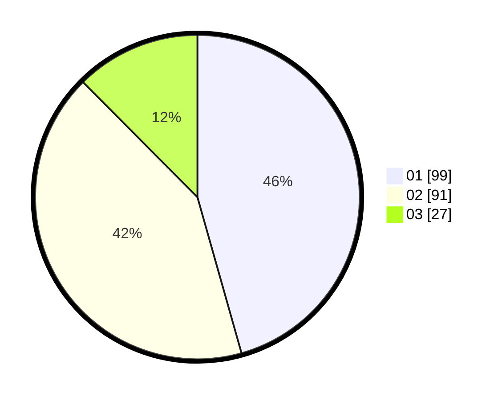

# Hasil

Hasil perolehan suara paslon dapat dilihat pada file paslon-01.txt, paslon-02.txt, dan paslon-03.txt.

Jika tidak ada, artinya data tersebut belum ada pada SIREKAP.

## Perolehan Suara

 * Paslon 01: **99**.
 * Paslon 02: **91**.
 * Paslon 03: **27**.

## Foto C Plano

https://sirekap-obj-formc.kpu.go.id/5e5b/pemilu/ppwp/31/71/03/10/04/3171031004031-20240217-094126--5749285b-1044-416c-88d2-dbc48471260a.jpg

https://sirekap-obj-formc.kpu.go.id/5e5b/pemilu/ppwp/31/71/03/10/04/3171031004031-20240217-094127--c0688933-96ba-4b0a-a2e1-14b8092b3056.jpg

https://sirekap-obj-formc.kpu.go.id/5e5b/pemilu/ppwp/31/71/03/10/04/3171031004031-20240217-094127--cc011132-4761-4dc4-bfeb-37c692fcf069.jpg

## DATA PEMILIH TETAP

Jumlah pemilih dalam DPT: **221**.
 * L: **109**.
 * P: **112**.

## DATA PENGGUNA HAK PILIH

Jumlah pengguna hak pilih dalam DPT: **211**.
 * L: **104**.
 * P: **107**.

Jumlah pengguna hak pilih dalam DPTb: **9**.
 * L: **5**.
 * P: **4**.

Jumlah pengguna hak pilih dalam DPK: **1**.
 * L: **0**.
 * P: **1**.

Jumlah pengguna hak pilih: **221**.
 * L: **109**.
 * P: **112**.

## JUMLAH SUARA SAH DAN TIDAK SAH

JUMLAH SELURUH SUARA SAH: **217**.

JUMLAH SUARA TIDAK SAH: **4**.

JUMLAH SELURUH SUARA SAH DAN SUARA TIDAK SAH: **221**.
