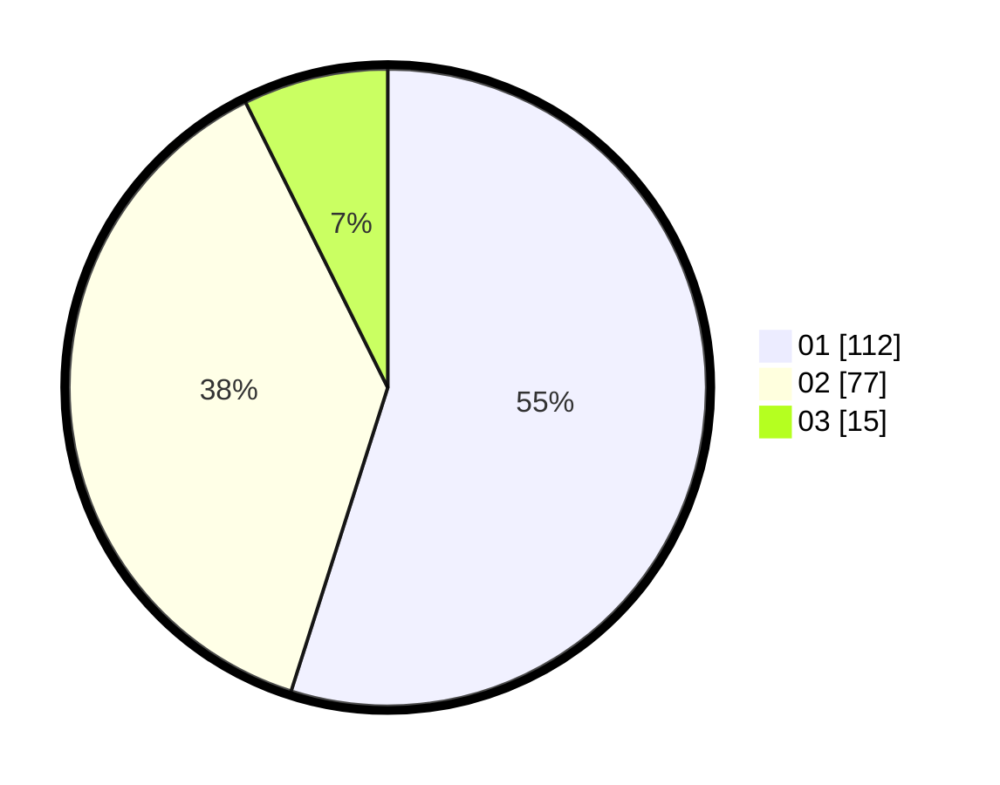

# Hasil

Hasil perolehan suara paslon dapat dilihat pada file paslon-01.txt, paslon-02.txt, dan paslon-03.txt.

Jika tidak ada, artinya data tersebut belum ada pada SIREKAP.

## Perolehan Suara

 * Paslon 01: **112**.
 * Paslon 02: **77**.
 * Paslon 03: **15**.

## Foto C Plano

https://sirekap-obj-formc.kpu.go.id/ed2a/pemilu/ppwp/31/71/03/10/04/3171031004037-20240214-202704--0f1fdcc0-24ed-433d-89b7-db127febd880.jpg

https://sirekap-obj-formc.kpu.go.id/ed2a/pemilu/ppwp/31/71/03/10/04/3171031004037-20240214-193911--5f778ff5-aa1f-4dd8-a932-7c0eaba05a59.jpg

https://sirekap-obj-formc.kpu.go.id/ed2a/pemilu/ppwp/31/71/03/10/04/3171031004037-20240214-194018--d9978c08-6d51-45cb-8851-71eb74028431.jpg

## DATA PEMILIH TETAP

Jumlah pemilih dalam DPT: **275**.
 * L: **137**.
 * P: **138**.

## DATA PENGGUNA HAK PILIH

Jumlah pengguna hak pilih dalam DPT: **205**.
 * L: **100**.
 * P: **105**.

Jumlah pengguna hak pilih dalam DPTb: **4**.
 * L: **4**.
 * P: **0**.

Jumlah pengguna hak pilih dalam DPK: **0**.
 * L: **0**.
 * P: **0**.

Jumlah pengguna hak pilih: **209**.
 * L: **104**.
 * P: **105**.

## JUMLAH SUARA SAH DAN TIDAK SAH

JUMLAH SELURUH SUARA SAH: **204**.

JUMLAH SUARA TIDAK SAH: **5**.

JUMLAH SELURUH SUARA SAH DAN SUARA TIDAK SAH: **209**.
