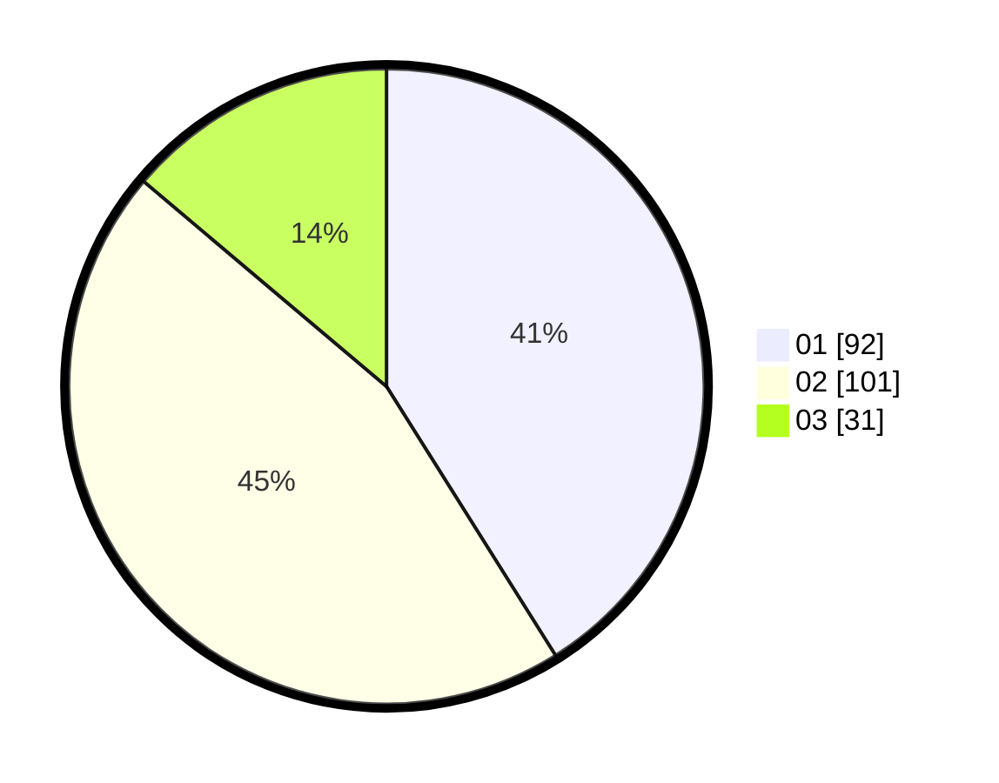

# Hasil

Hasil perolehan suara paslon dapat dilihat pada file paslon-01.txt, paslon-02.txt, dan paslon-03.txt.

Jika tidak ada, artinya data tersebut belum ada pada SIREKAP.

## Perolehan Suara

 * Paslon 01: **92**.
 * Paslon 02: **101**.
 * Paslon 03: **31**.

## Foto C Plano

https://sirekap-obj-formc.kpu.go.id/2977/pemilu/ppwp/31/71/03/10/04/3171031004039-20240214-193352--dbb57fe4-8a0f-4a7a-acd5-a651b5c6e181.jpg

https://sirekap-obj-formc.kpu.go.id/2977/pemilu/ppwp/31/71/03/10/04/3171031004039-20240214-193658--2f8c4d47-d833-4d8f-b8e4-cb42ce06ae80.jpg

https://sirekap-obj-formc.kpu.go.id/2977/pemilu/ppwp/31/71/03/10/04/3171031004039-20240214-193923--9a6139f9-60a1-46a4-a24b-419186244a6f.jpg

## DATA PEMILIH TETAP

Jumlah pemilih dalam DPT: **279**.
 * L: **138**.
 * P: **141**.

## DATA PENGGUNA HAK PILIH

Jumlah pengguna hak pilih dalam DPT: **221**.
 * L: **105**.
 * P: **116**.

Jumlah pengguna hak pilih dalam DPTb: **4**.
 * L: **2**.
 * P: **2**.

Jumlah pengguna hak pilih dalam DPK: **3**.
 * L: **2**.
 * P: **1**.

Jumlah pengguna hak pilih: **228**.
 * L: **109**.
 * P: **119**.

## JUMLAH SUARA SAH DAN TIDAK SAH

JUMLAH SELURUH SUARA SAH: **224**.

JUMLAH SUARA TIDAK SAH: **4**.

JUMLAH SELURUH SUARA SAH DAN SUARA TIDAK SAH: **228**.
