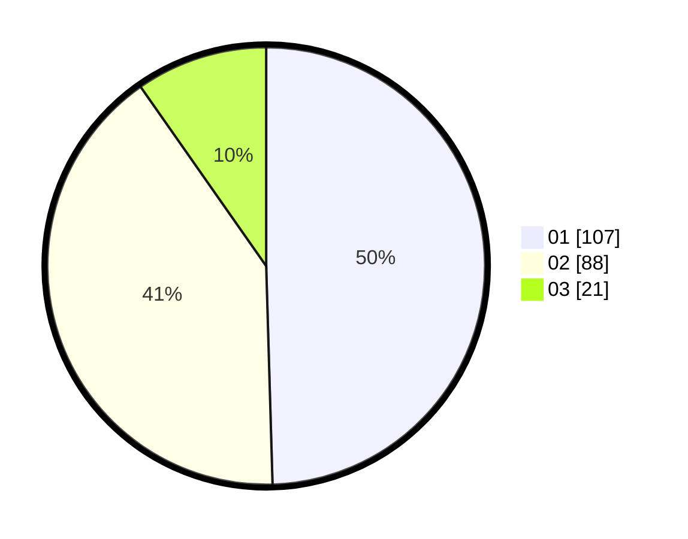

# Hasil

Hasil perolehan suara paslon dapat dilihat pada file paslon-01.txt, paslon-02.txt, dan paslon-03.txt.

Jika tidak ada, artinya data tersebut belum ada pada SIREKAP.

## Perolehan Suara

 * Paslon 01: **107**.
 * Paslon 02: **88**.
 * Paslon 03: **21**.

## Foto C Plano

https://sirekap-obj-formc.kpu.go.id/08f9/pemilu/ppwp/31/71/03/10/04/3171031004040-20240214-193335--fc568527-4669-42c0-8c12-934b98b24e0a.jpg

https://sirekap-obj-formc.kpu.go.id/08f9/pemilu/ppwp/31/71/03/10/04/3171031004040-20240214-192928--addcb0f9-16f0-4710-97c4-05780dace938.jpg

https://sirekap-obj-formc.kpu.go.id/08f9/pemilu/ppwp/31/71/03/10/04/3171031004040-20240214-193128--8526314b-6db0-478b-ac52-d723aac648dd.jpg

## DATA PEMILIH TETAP

Jumlah pemilih dalam DPT: **270**.
 * L: **134**.
 * P: **136**.

## DATA PENGGUNA HAK PILIH

Jumlah pengguna hak pilih dalam DPT: **216**.
 * L: **104**.
 * P: **112**.

Jumlah pengguna hak pilih dalam DPTb: **2**.
 * L: **1**.
 * P: **1**.

Jumlah pengguna hak pilih dalam DPK: **2**.
 * L: **0**.
 * P: **2**.

Jumlah pengguna hak pilih: **220**.
 * L: **105**.
 * P: **115**.

## JUMLAH SUARA SAH DAN TIDAK SAH

JUMLAH SELURUH SUARA SAH: **216**.

JUMLAH SUARA TIDAK SAH: **4**.

JUMLAH SELURUH SUARA SAH DAN SUARA TIDAK SAH: **220**.
