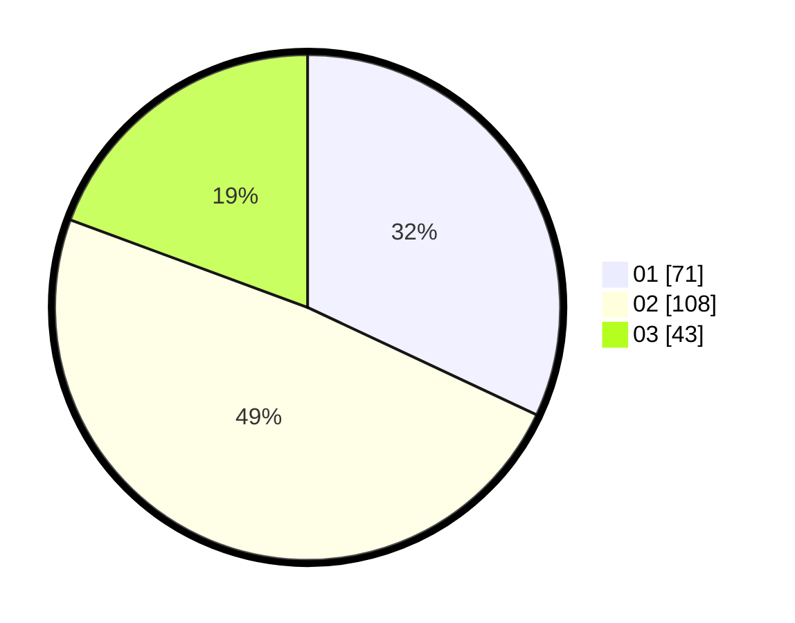

# Hasil

Hasil perolehan suara paslon dapat dilihat pada file paslon-01.txt, paslon-02.txt, dan paslon-03.txt.

Jika tidak ada, artinya data tersebut belum ada pada SIREKAP.

## Perolehan Suara

 * Paslon 01: **71**.
 * Paslon 02: **108**.
 * Paslon 03: **43**.

## Foto C Plano

https://sirekap-obj-formc.kpu.go.id/3427/pemilu/ppwp/31/71/03/10/04/3171031004042-20240214-204630--02164e3c-65ff-4ef4-a766-d5e358228abd.jpg

https://sirekap-obj-formc.kpu.go.id/3427/pemilu/ppwp/31/71/03/10/04/3171031004042-20240214-204754--be72001a-7a94-4fa4-b89f-199e9b459f70.jpg

https://sirekap-obj-formc.kpu.go.id/3427/pemilu/ppwp/31/71/03/10/04/3171031004042-20240214-204900--87d9d915-b244-43b4-808a-e9ca0a7fef9d.jpg
