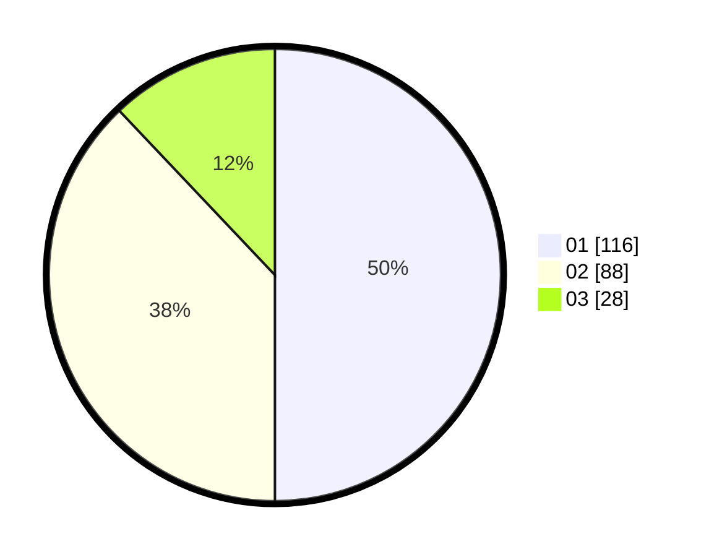

# Hasil

Hasil perolehan suara paslon dapat dilihat pada file paslon-01.txt, paslon-02.txt, dan paslon-03.txt.

Jika tidak ada, artinya data tersebut belum ada pada SIREKAP.

## Perolehan Suara

 * Paslon 01: **116**.
 * Paslon 02: **88**.
 * Paslon 03: **28**.

## Foto C Plano

https://sirekap-obj-formc.kpu.go.id/58cf/pemilu/ppwp/31/71/03/10/04/3171031004044-20240214-203619--213c7666-44ad-430e-b65f-2cd7dcdd3e5c.jpg

https://sirekap-obj-formc.kpu.go.id/58cf/pemilu/ppwp/31/71/03/10/04/3171031004044-20240214-200340--8dbd8d25-df06-4186-b63c-a02e6ed81c93.jpg

https://sirekap-obj-formc.kpu.go.id/58cf/pemilu/ppwp/31/71/03/10/04/3171031004044-20240214-200955--7743a908-0ed6-45e5-b024-abd34960a9bc.jpg
