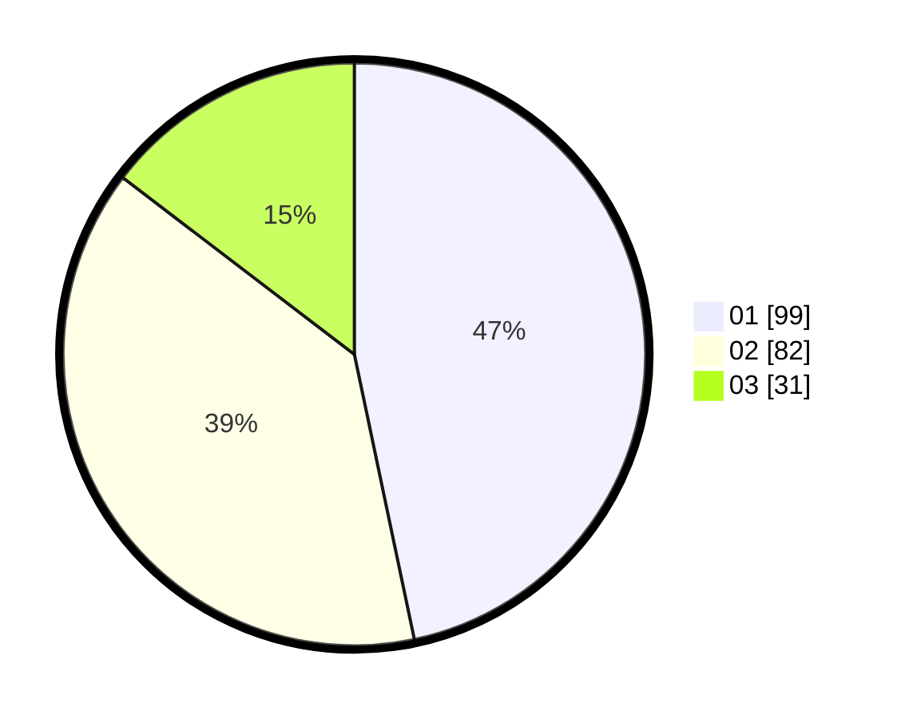

# Hasil

Hasil perolehan suara paslon dapat dilihat pada file paslon-01.txt, paslon-02.txt, dan paslon-03.txt.

Jika tidak ada, artinya data tersebut belum ada pada SIREKAP.

## Perolehan Suara

 * Paslon 01: **99**.
 * Paslon 02: **82**.
 * Paslon 03: **31**.

## Foto C Plano

https://sirekap-obj-formc.kpu.go.id/bfba/pemilu/ppwp/31/71/03/10/04/3171031004045-20240216-061447--e2678507-28c9-4a46-b6b9-71978ce5b890.jpg

https://sirekap-obj-formc.kpu.go.id/bfba/pemilu/ppwp/31/71/03/10/04/3171031004045-20240216-061448--cf137fd9-bba6-4844-8326-a0187978f699.jpg

https://sirekap-obj-formc.kpu.go.id/bfba/pemilu/ppwp/31/71/03/10/04/3171031004045-20240216-061448--01bda3e2-9969-4b16-8529-754cc4305695.jpg

## DATA PEMILIH TETAP

Jumlah pemilih dalam DPT: **273**.
 * L: **130**.
 * P: **143**.

## DATA PENGGUNA HAK PILIH

Jumlah pengguna hak pilih dalam DPT: **215**.
 * L: **105**.
 * P: **110**.

Jumlah pengguna hak pilih dalam DPTb: **0**.
 * L: **0**.
 * P: **0**.

Jumlah pengguna hak pilih dalam DPK: **1**.
 * L: **1**.
 * P: **0**.

Jumlah pengguna hak pilih: **216**.
 * L: **106**.
 * P: **110**.

## JUMLAH SUARA SAH DAN TIDAK SAH

JUMLAH SELURUH SUARA SAH: **212**.

JUMLAH SUARA TIDAK SAH: **4**.

JUMLAH SELURUH SUARA SAH DAN SUARA TIDAK SAH: **216**.
