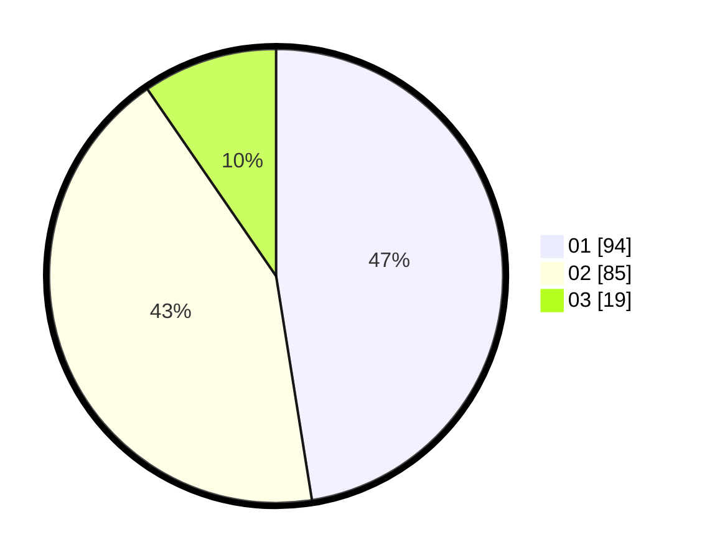

# Hasil

Hasil perolehan suara paslon dapat dilihat pada file paslon-01.txt, paslon-02.txt, dan paslon-03.txt.

Jika tidak ada, artinya data tersebut belum ada pada SIREKAP.

## Perolehan Suara

 * Paslon 01: **94**.
 * Paslon 02: **85**.
 * Paslon 03: **19**.

## Foto C Plano

https://sirekap-obj-formc.kpu.go.id/afa5/pemilu/ppwp/31/71/03/10/04/3171031004046-20240215-070954--eefe24ed-e368-43b9-b1a8-56cf551b0ba5.jpg

https://sirekap-obj-formc.kpu.go.id/afa5/pemilu/ppwp/31/71/03/10/04/3171031004046-20240215-070955--16e8f683-2107-43a7-8550-9bd0333e1e74.jpg

https://sirekap-obj-formc.kpu.go.id/afa5/pemilu/ppwp/31/71/03/10/04/3171031004046-20240215-070955--ae926fbf-194c-4e6e-b8f9-13ed86ea3c0f.jpg

## DATA PEMILIH TETAP

Jumlah pemilih dalam DPT: **279**.
 * L: **140**.
 * P: **139**.

## DATA PENGGUNA HAK PILIH

Jumlah pengguna hak pilih dalam DPT: **199**.
 * L: **99**.
 * P: **100**.

Jumlah pengguna hak pilih dalam DPTb: **2**.
 * L: **1**.
 * P: **1**.

Jumlah pengguna hak pilih dalam DPK: **2**.
 * L: **1**.
 * P: **1**.

Jumlah pengguna hak pilih: **203**.
 * L: **101**.
 * P: **102**.

## JUMLAH SUARA SAH DAN TIDAK SAH

JUMLAH SELURUH SUARA SAH: **198**.

JUMLAH SUARA TIDAK SAH: **5**.

JUMLAH SELURUH SUARA SAH DAN SUARA TIDAK SAH: **203**.
