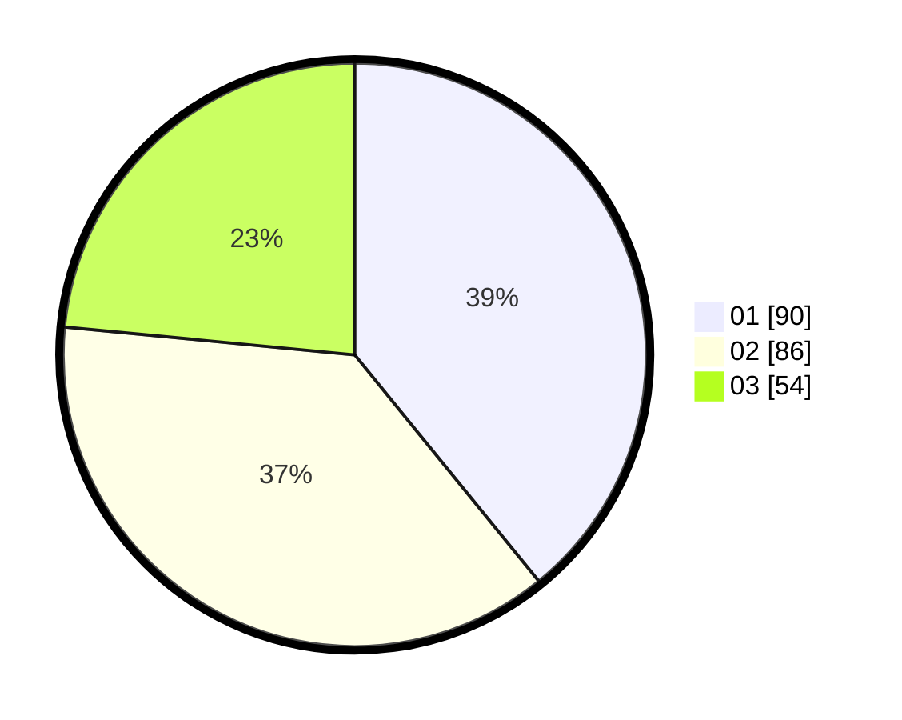

# Hasil

Hasil perolehan suara paslon dapat dilihat pada file paslon-01.txt, paslon-02.txt, dan paslon-03.txt.

Jika tidak ada, artinya data tersebut belum ada pada SIREKAP.

## Perolehan Suara

 * Paslon 01: **90**.
 * Paslon 02: **86**.
 * Paslon 03: **54**.

## Foto C Plano

https://sirekap-obj-formc.kpu.go.id/7405/pemilu/ppwp/31/71/03/10/04/3171031004047-20240214-155542--7a375e0c-a97e-4428-b7ec-bbcaad7d8328.jpg

https://sirekap-obj-formc.kpu.go.id/7405/pemilu/ppwp/31/71/03/10/04/3171031004047-20240214-155710--f8c73a97-0d0e-474a-a436-28038bc3b001.jpg

https://sirekap-obj-formc.kpu.go.id/7405/pemilu/ppwp/31/71/03/10/04/3171031004047-20240214-160108--ca72c6d5-07f1-4184-a595-464d4f74f079.jpg

## DATA PEMILIH TETAP

Jumlah pemilih dalam DPT: **275**.
 * L: **137**.
 * P: **138**.

## DATA PENGGUNA HAK PILIH

Jumlah pengguna hak pilih dalam DPT: **224**.
 * L: **108**.
 * P: **116**.

Jumlah pengguna hak pilih dalam DPTb: **5**.
 * L: **3**.
 * P: **2**.

Jumlah pengguna hak pilih dalam DPK: **5**.
 * L: **3**.
 * P: **2**.

Jumlah pengguna hak pilih: **234**.
 * L: **114**.
 * P: **120**.

## JUMLAH SUARA SAH DAN TIDAK SAH

JUMLAH SELURUH SUARA SAH: **230**.

JUMLAH SUARA TIDAK SAH: **4**.

JUMLAH SELURUH SUARA SAH DAN SUARA TIDAK SAH: **234**.
