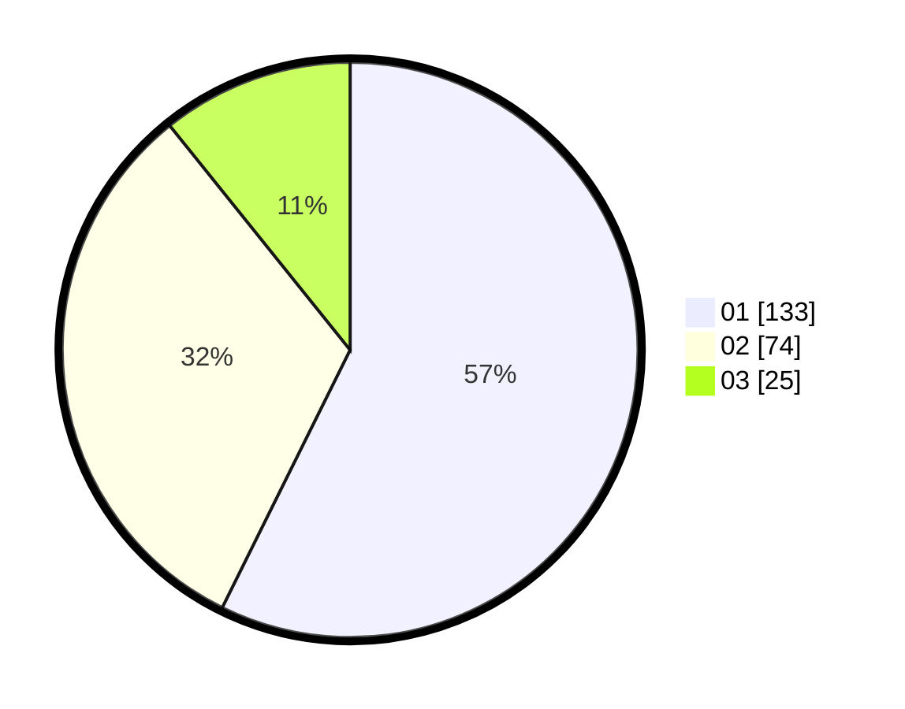

# Hasil

Hasil perolehan suara paslon dapat dilihat pada file paslon-01.txt, paslon-02.txt, dan paslon-03.txt.

Jika tidak ada, artinya data tersebut belum ada pada SIREKAP.

## Perolehan Suara

 * Paslon 01: **133**.
 * Paslon 02: **74**.
 * Paslon 03: **25**.

## Foto C Plano

https://sirekap-obj-formc.kpu.go.id/8c8c/pemilu/ppwp/31/71/03/10/04/3171031004048-20240214-201445--a4860ec8-7cf5-4810-b0b8-a08561b5c57d.jpg

https://sirekap-obj-formc.kpu.go.id/8c8c/pemilu/ppwp/31/71/03/10/04/3171031004048-20240214-202005--1b4c6d57-f183-4883-88ab-049621260bf6.jpg

https://sirekap-obj-formc.kpu.go.id/8c8c/pemilu/ppwp/31/71/03/10/04/3171031004048-20240214-202222--ed1eae32-88a9-48d4-888d-68f662fcbb4c.jpg

## DATA PEMILIH TETAP

Jumlah pemilih dalam DPT: **274**.
 * L: **137**.
 * P: **137**.

## DATA PENGGUNA HAK PILIH

Jumlah pengguna hak pilih dalam DPT: **224**.
 * L: **108**.
 * P: **116**.

Jumlah pengguna hak pilih dalam DPTb: **5**.
 * L: **1**.
 * P: **4**.

Jumlah pengguna hak pilih dalam DPK: **4**.
 * L: **3**.
 * P: **1**.

Jumlah pengguna hak pilih: **233**.
 * L: **112**.
 * P: **121**.

## JUMLAH SUARA SAH DAN TIDAK SAH

JUMLAH SELURUH SUARA SAH: **232**.

JUMLAH SUARA TIDAK SAH: **1**.

JUMLAH SELURUH SUARA SAH DAN SUARA TIDAK SAH: **233**.
