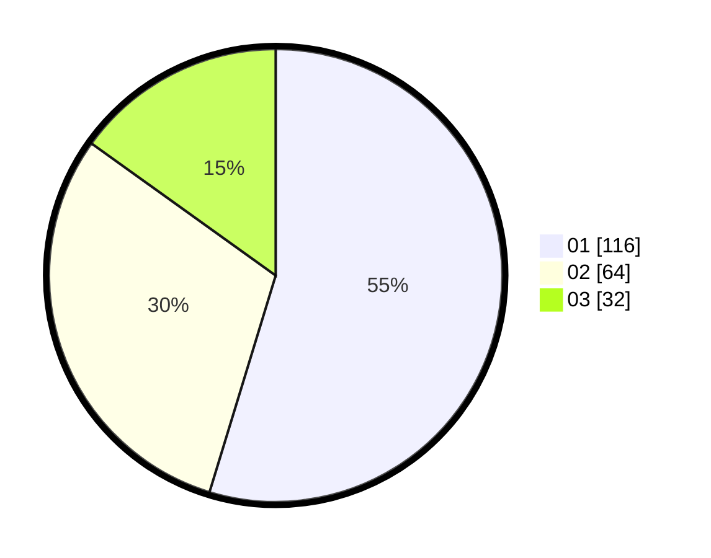

# Hasil

Hasil perolehan suara paslon dapat dilihat pada file paslon-01.txt, paslon-02.txt, dan paslon-03.txt.

Jika tidak ada, artinya data tersebut belum ada pada SIREKAP.

## Perolehan Suara

 * Paslon 01: **116**.
 * Paslon 02: **64**.
 * Paslon 03: **32**.

## Foto C Plano

https://sirekap-obj-formc.kpu.go.id/8cf6/pemilu/ppwp/31/71/03/10/04/3171031004049-20240215-224235--cff0bb63-9849-41e6-ac67-a56a93c46834.jpg

https://sirekap-obj-formc.kpu.go.id/8cf6/pemilu/ppwp/31/71/03/10/04/3171031004049-20240215-224239--93b27321-4d76-4ae4-85de-aa8723ed24bd.jpg

https://sirekap-obj-formc.kpu.go.id/8cf6/pemilu/ppwp/31/71/03/10/04/3171031004049-20240215-224236--68d92fb0-9ec2-456f-929f-9241a5c5386a.jpg

## DATA PEMILIH TETAP

Jumlah pemilih dalam DPT: **279**.
 * L: **148**.
 * P: **131**.

## DATA PENGGUNA HAK PILIH

Jumlah pengguna hak pilih dalam DPT: **218**.
 * L: **109**.
 * P: **109**.

Jumlah pengguna hak pilih dalam DPTb: **3**.
 * L: **1**.
 * P: **2**.

Jumlah pengguna hak pilih dalam DPK: **1**.
 * L: **1**.
 * P: **0**.

Jumlah pengguna hak pilih: **222**.
 * L: **111**.
 * P: **111**.

## JUMLAH SUARA SAH DAN TIDAK SAH

JUMLAH SELURUH SUARA SAH: **212**.

JUMLAH SUARA TIDAK SAH: **10**.

JUMLAH SELURUH SUARA SAH DAN SUARA TIDAK SAH: **222**.
