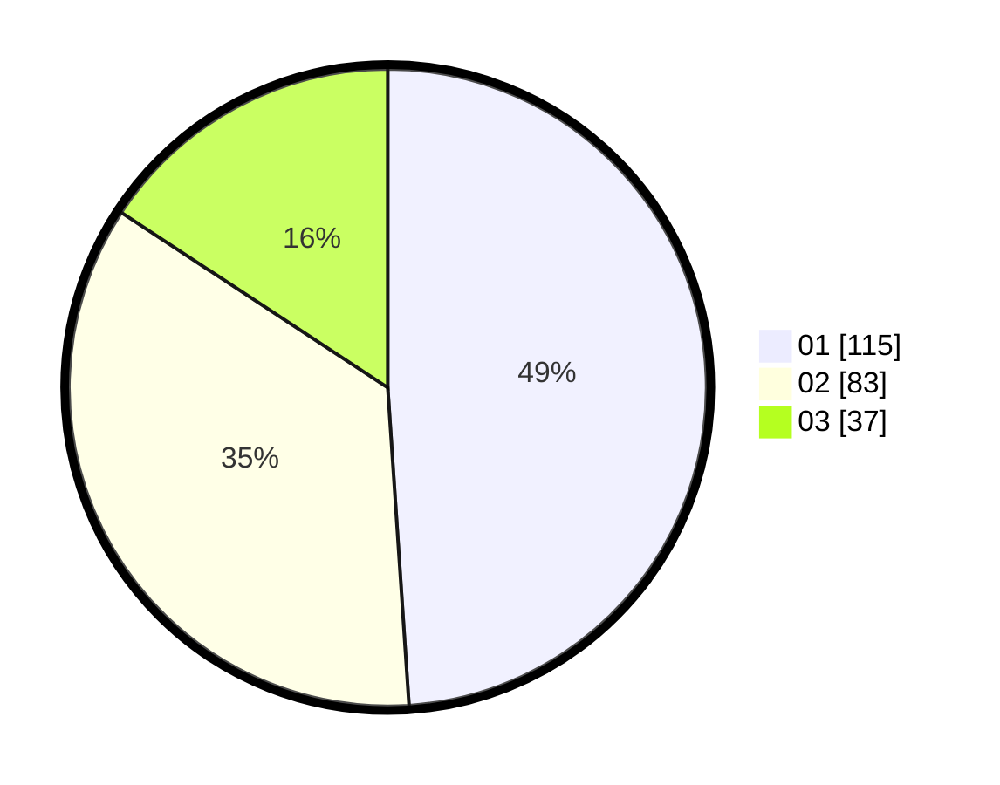

# Hasil

Hasil perolehan suara paslon dapat dilihat pada file paslon-01.txt, paslon-02.txt, dan paslon-03.txt.

Jika tidak ada, artinya data tersebut belum ada pada SIREKAP.

## Perolehan Suara

 * Paslon 01: **115**.
 * Paslon 02: **83**.
 * Paslon 03: **37**.

## Foto C Plano

https://sirekap-obj-formc.kpu.go.id/f231/pemilu/ppwp/31/71/03/10/04/3171031004050-20240216-004854--f7cc0a59-cb7f-41fc-9e5e-f0363e2561ae.jpg

https://sirekap-obj-formc.kpu.go.id/f231/pemilu/ppwp/31/71/03/10/04/3171031004050-20240216-004858--aab17a4c-47b9-4154-8e24-f1d907a3508d.jpg

https://sirekap-obj-formc.kpu.go.id/f231/pemilu/ppwp/31/71/03/10/04/3171031004050-20240216-004856--90fd6fd3-26be-451d-ab0c-a3669e7f4573.jpg

## DATA PEMILIH TETAP

Jumlah pemilih dalam DPT: **273**.
 * L: **125**.
 * P: **148**.

## DATA PENGGUNA HAK PILIH

Jumlah pengguna hak pilih dalam DPT: **230**.
 * L: **102**.
 * P: **128**.

Jumlah pengguna hak pilih dalam DPTb: **8**.
 * L: **5**.
 * P: **3**.

Jumlah pengguna hak pilih dalam DPK: **0**.
 * L: **0**.
 * P: **0**.

Jumlah pengguna hak pilih: **238**.
 * L: **107**.
 * P: **131**.

## JUMLAH SUARA SAH DAN TIDAK SAH

JUMLAH SELURUH SUARA SAH: **235**.

JUMLAH SUARA TIDAK SAH: **3**.

JUMLAH SELURUH SUARA SAH DAN SUARA TIDAK SAH: **238**.
