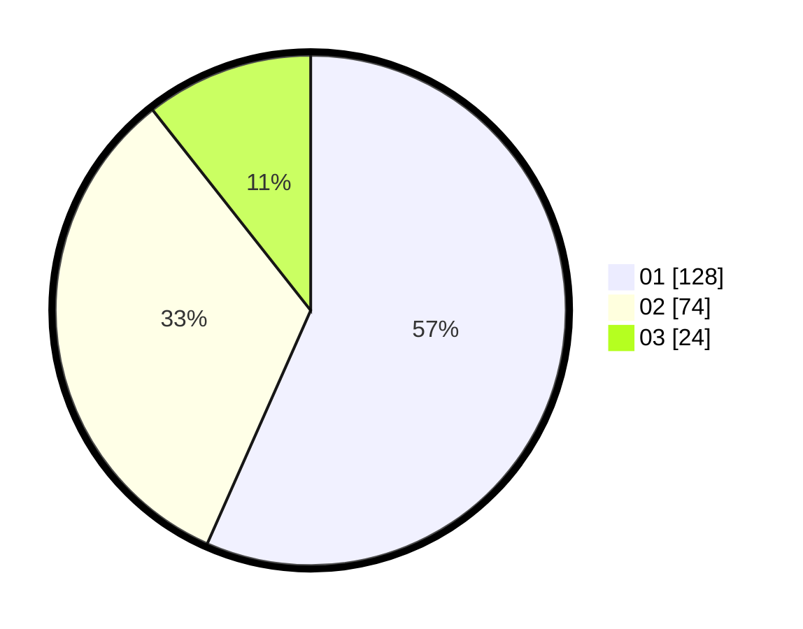

# Hasil

Hasil perolehan suara paslon dapat dilihat pada file paslon-01.txt, paslon-02.txt, dan paslon-03.txt.

Jika tidak ada, artinya data tersebut belum ada pada SIREKAP.

## Perolehan Suara

 * Paslon 01: **128**.
 * Paslon 02: **74**.
 * Paslon 03: **24**.

## Foto C Plano

https://sirekap-obj-formc.kpu.go.id/eed6/pemilu/ppwp/31/71/03/10/04/3171031004053-20240215-231800--c658e605-1fda-4814-8313-3c91bdc696f7.jpg

https://sirekap-obj-formc.kpu.go.id/eed6/pemilu/ppwp/31/71/03/10/04/3171031004053-20240215-231803--44daef81-5dcf-442e-ac47-d9d276c175a6.jpg

https://sirekap-obj-formc.kpu.go.id/eed6/pemilu/ppwp/31/71/03/10/04/3171031004053-20240215-231801--e623ca41-72e5-42d6-ab2c-7f29b2ab3206.jpg

## DATA PEMILIH TETAP

Jumlah pemilih dalam DPT: **273**.
 * L: **133**.
 * P: **140**.

## DATA PENGGUNA HAK PILIH

Jumlah pengguna hak pilih dalam DPT: **220**.
 * L: **101**.
 * P: **119**.

Jumlah pengguna hak pilih dalam DPTb: **8**.
 * L: **5**.
 * P: **3**.

Jumlah pengguna hak pilih dalam DPK: **2**.
 * L: **1**.
 * P: **1**.

Jumlah pengguna hak pilih: **230**.
 * L: **107**.
 * P: **123**.

## JUMLAH SUARA SAH DAN TIDAK SAH

JUMLAH SELURUH SUARA SAH: **226**.

JUMLAH SUARA TIDAK SAH: **4**.

JUMLAH SELURUH SUARA SAH DAN SUARA TIDAK SAH: **230**.
