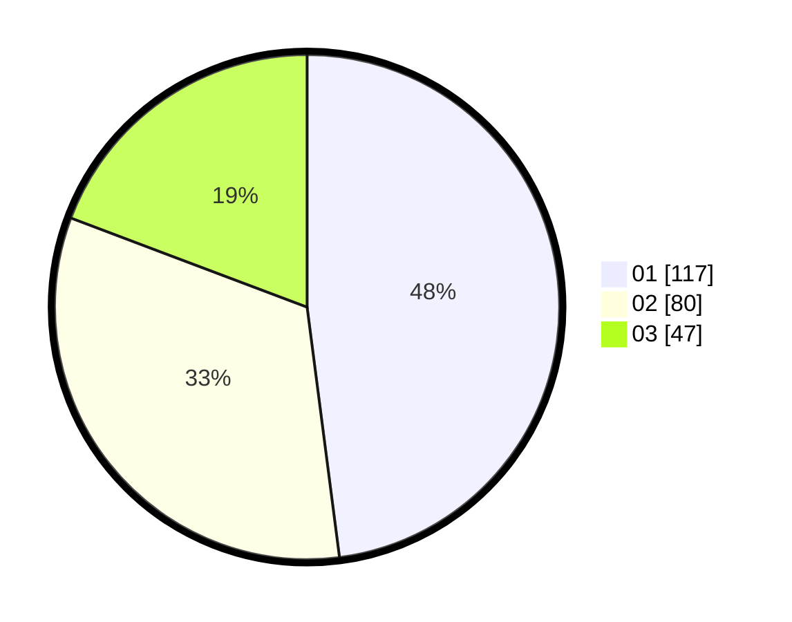

# Hasil

Hasil perolehan suara paslon dapat dilihat pada file paslon-01.txt, paslon-02.txt, dan paslon-03.txt.

Jika tidak ada, artinya data tersebut belum ada pada SIREKAP.

## Perolehan Suara

 * Paslon 01: **117**.
 * Paslon 02: **80**.
 * Paslon 03: **47**.

## Foto C Plano

https://sirekap-obj-formc.kpu.go.id/dab2/pemilu/ppwp/31/71/03/10/04/3171031004055-20240216-035549--ef009f8d-076a-491a-8b3c-0415c5129273.jpg

https://sirekap-obj-formc.kpu.go.id/dab2/pemilu/ppwp/31/71/03/10/04/3171031004055-20240216-035510--e4f21d00-640d-40f7-ba2f-8e78b9eaa705.jpg

https://sirekap-obj-formc.kpu.go.id/dab2/pemilu/ppwp/31/71/03/10/04/3171031004055-20240216-035501--720ff309-afcf-41da-8bf3-02fd9980ec55.jpg

## DATA PEMILIH TETAP

Jumlah pemilih dalam DPT: **278**.
 * L: **139**.
 * P: **139**.

## DATA PENGGUNA HAK PILIH

Jumlah pengguna hak pilih dalam DPT: **240**.
 * L: **120**.
 * P: **120**.

Jumlah pengguna hak pilih dalam DPTb: **5**.
 * L: **1**.
 * P: **4**.

Jumlah pengguna hak pilih dalam DPK: **1**.
 * L: **0**.
 * P: **1**.

Jumlah pengguna hak pilih: **246**.
 * L: **121**.
 * P: **125**.

## JUMLAH SUARA SAH DAN TIDAK SAH

JUMLAH SELURUH SUARA SAH: **244**.

JUMLAH SUARA TIDAK SAH: **2**.

JUMLAH SELURUH SUARA SAH DAN SUARA TIDAK SAH: **246**.
