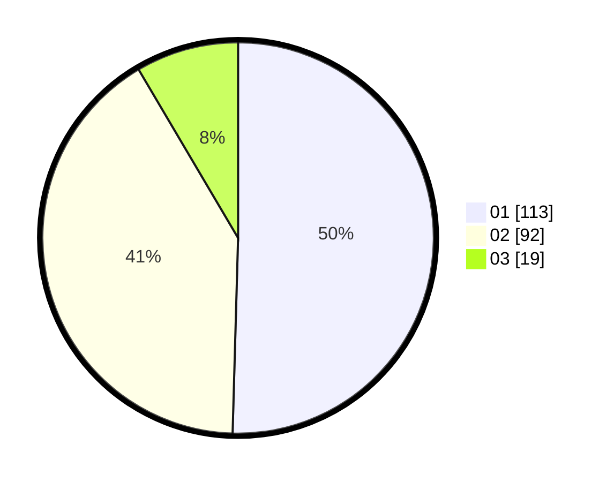

# Hasil

Hasil perolehan suara paslon dapat dilihat pada file paslon-01.txt, paslon-02.txt, dan paslon-03.txt.

Jika tidak ada, artinya data tersebut belum ada pada SIREKAP.

## Perolehan Suara

 * Paslon 01: **113**.
 * Paslon 02: **92**.
 * Paslon 03: **19**.

## Foto C Plano

https://sirekap-obj-formc.kpu.go.id/2484/pemilu/ppwp/31/71/03/10/04/3171031004062-20240215-211033--ed1ca72d-62f6-4682-8379-288d7dba02a6.jpg

https://sirekap-obj-formc.kpu.go.id/2484/pemilu/ppwp/31/71/03/10/04/3171031004062-20240215-211034--09c2bda3-fc15-45a1-a025-0eddb697cb85.jpg

https://sirekap-obj-formc.kpu.go.id/2484/pemilu/ppwp/31/71/03/10/04/3171031004062-20240215-211033--df42f2f9-ce67-4e33-9495-fcdebc96bf2f.jpg

## DATA PEMILIH TETAP

Jumlah pemilih dalam DPT: **281**.
 * L: **126**.
 * P: **155**.

## DATA PENGGUNA HAK PILIH

Jumlah pengguna hak pilih dalam DPT: **216**.
 * L: **96**.
 * P: **120**.

Jumlah pengguna hak pilih dalam DPTb: **6**.
 * L: **2**.
 * P: **4**.

Jumlah pengguna hak pilih dalam DPK: **4**.
 * L: **2**.
 * P: **2**.

Jumlah pengguna hak pilih: **226**.
 * L: **100**.
 * P: **126**.

## JUMLAH SUARA SAH DAN TIDAK SAH

JUMLAH SELURUH SUARA SAH: **224**.

JUMLAH SUARA TIDAK SAH: **2**.

JUMLAH SELURUH SUARA SAH DAN SUARA TIDAK SAH: **226**.
