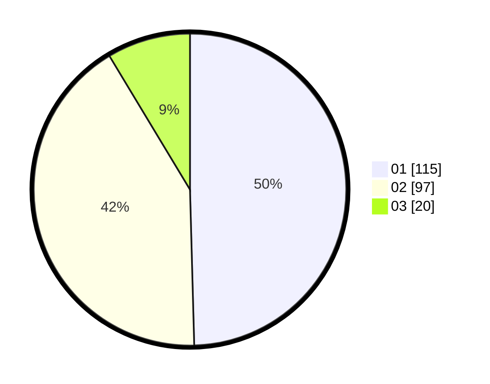

# Hasil

Hasil perolehan suara paslon dapat dilihat pada file paslon-01.txt, paslon-02.txt, dan paslon-03.txt.

Jika tidak ada, artinya data tersebut belum ada pada SIREKAP.

## Perolehan Suara

 * Paslon 01: **115**.
 * Paslon 02: **97**.
 * Paslon 03: **20**.

## Foto C Plano

https://sirekap-obj-formc.kpu.go.id/a371/pemilu/ppwp/31/71/03/10/04/3171031004066-20240214-195839--f04bd9be-c380-4188-8971-5f17cc0c951c.jpg

https://sirekap-obj-formc.kpu.go.id/a371/pemilu/ppwp/31/71/03/10/04/3171031004066-20240214-200028--0c0013ef-4a9f-4bba-a8ec-d0037b991229.jpg

https://sirekap-obj-formc.kpu.go.id/a371/pemilu/ppwp/31/71/03/10/04/3171031004066-20240214-200207--dcff3abf-3165-48cc-b6f5-ab5dae2256ff.jpg

## DATA PEMILIH TETAP

Jumlah pemilih dalam DPT: **280**.
 * L: **145**.
 * P: **135**.

## DATA PENGGUNA HAK PILIH

Jumlah pengguna hak pilih dalam DPT: **233**.
 * L: **117**.
 * P: **116**.

Jumlah pengguna hak pilih dalam DPTb: **0**.
 * L: **0**.
 * P: **0**.

Jumlah pengguna hak pilih dalam DPK: **0**.
 * L: **0**.
 * P: **0**.

Jumlah pengguna hak pilih: **233**.
 * L: **117**.
 * P: **116**.

## JUMLAH SUARA SAH DAN TIDAK SAH

JUMLAH SELURUH SUARA SAH: **232**.

JUMLAH SUARA TIDAK SAH: **1**.

JUMLAH SELURUH SUARA SAH DAN SUARA TIDAK SAH: **233**.
