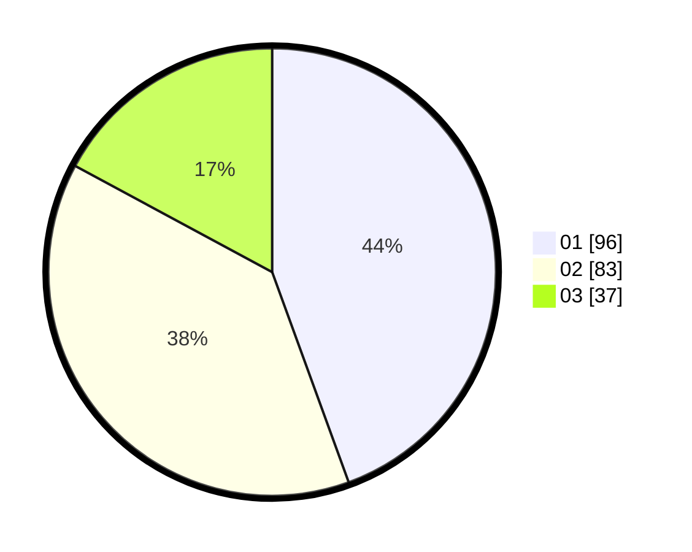

# Hasil

Hasil perolehan suara paslon dapat dilihat pada file paslon-01.txt, paslon-02.txt, dan paslon-03.txt.

Jika tidak ada, artinya data tersebut belum ada pada SIREKAP.

## Perolehan Suara

 * Paslon 01: **96**.
 * Paslon 02: **83**.
 * Paslon 03: **37**.

## Foto C Plano

https://sirekap-obj-formc.kpu.go.id/95e3/pemilu/ppwp/31/71/03/10/04/3171031004071-20240215-011214--1be301f2-224c-4c45-a743-d7f58d78374f.jpg

https://sirekap-obj-formc.kpu.go.id/95e3/pemilu/ppwp/31/71/03/10/04/3171031004071-20240215-011121--6ff5a02f-d46c-4f8f-a615-e7963e38b8b8.jpg

https://sirekap-obj-formc.kpu.go.id/95e3/pemilu/ppwp/31/71/03/10/04/3171031004071-20240215-010947--def74431-f753-4a9a-88ec-4f4ae3742129.jpg
