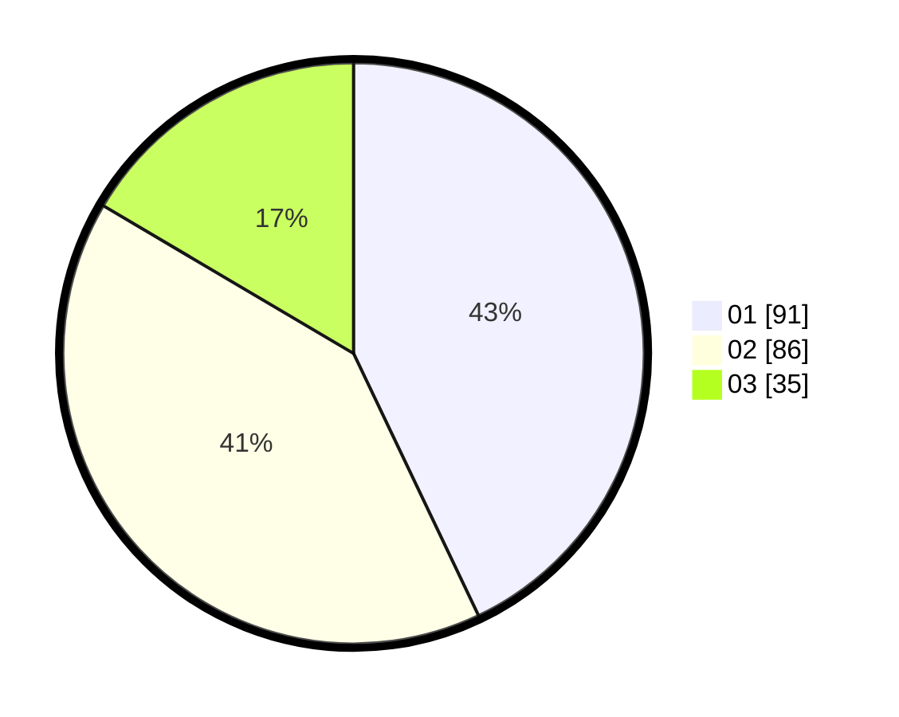

# Hasil

Hasil perolehan suara paslon dapat dilihat pada file paslon-01.txt, paslon-02.txt, dan paslon-03.txt.

Jika tidak ada, artinya data tersebut belum ada pada SIREKAP.

## Perolehan Suara

 * Paslon 01: **91**.
 * Paslon 02: **86**.
 * Paslon 03: **35**.

## Foto C Plano

https://sirekap-obj-formc.kpu.go.id/206b/pemilu/ppwp/31/71/03/10/04/3171031004072-20240215-005401--37277330-3c1d-4586-b63c-0a54b7613c31.jpg

https://sirekap-obj-formc.kpu.go.id/206b/pemilu/ppwp/31/71/03/10/04/3171031004072-20240215-005515--329a7ac1-edaa-4e4b-91a2-083c94035d06.jpg

https://sirekap-obj-formc.kpu.go.id/206b/pemilu/ppwp/31/71/03/10/04/3171031004072-20240215-005556--ab7ed67e-e24c-4d0c-9777-c96fc5f4c92d.jpg
