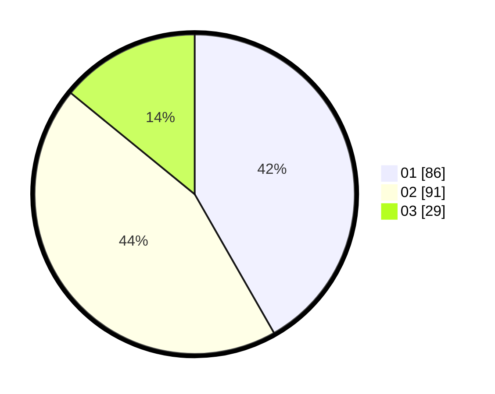

# Hasil

Hasil perolehan suara paslon dapat dilihat pada file paslon-01.txt, paslon-02.txt, dan paslon-03.txt.

Jika tidak ada, artinya data tersebut belum ada pada SIREKAP.

## Perolehan Suara

 * Paslon 01: **86**.
 * Paslon 02: **91**.
 * Paslon 03: **29**.

## Foto C Plano

https://sirekap-obj-formc.kpu.go.id/3002/pemilu/ppwp/31/71/03/10/04/3171031004073-20240214-164345--3ca341fa-b645-4b80-8103-f60d787fcdac.jpg

https://sirekap-obj-formc.kpu.go.id/3002/pemilu/ppwp/31/71/03/10/04/3171031004073-20240214-164346--c37168f3-a32d-4b2f-8e7b-06b01080412d.jpg

https://sirekap-obj-formc.kpu.go.id/3002/pemilu/ppwp/31/71/03/10/04/3171031004073-20240214-164345--ed0f6287-7f39-4319-b651-06940d8c8b55.jpg

## DATA PEMILIH TETAP

Jumlah pemilih dalam DPT: **279**.
 * L: **146**.
 * P: **133**.

## DATA PENGGUNA HAK PILIH

Jumlah pengguna hak pilih dalam DPT: **198**.
 * L: **103**.
 * P: **95**.

Jumlah pengguna hak pilih dalam DPTb: **9**.
 * L: **6**.
 * P: **3**.

Jumlah pengguna hak pilih dalam DPK: **2**.
 * L: **1**.
 * P: **1**.

Jumlah pengguna hak pilih: **209**.
 * L: **110**.
 * P: **99**.

## JUMLAH SUARA SAH DAN TIDAK SAH

JUMLAH SELURUH SUARA SAH: **206**.

JUMLAH SUARA TIDAK SAH: **3**.

JUMLAH SELURUH SUARA SAH DAN SUARA TIDAK SAH: **209**.
