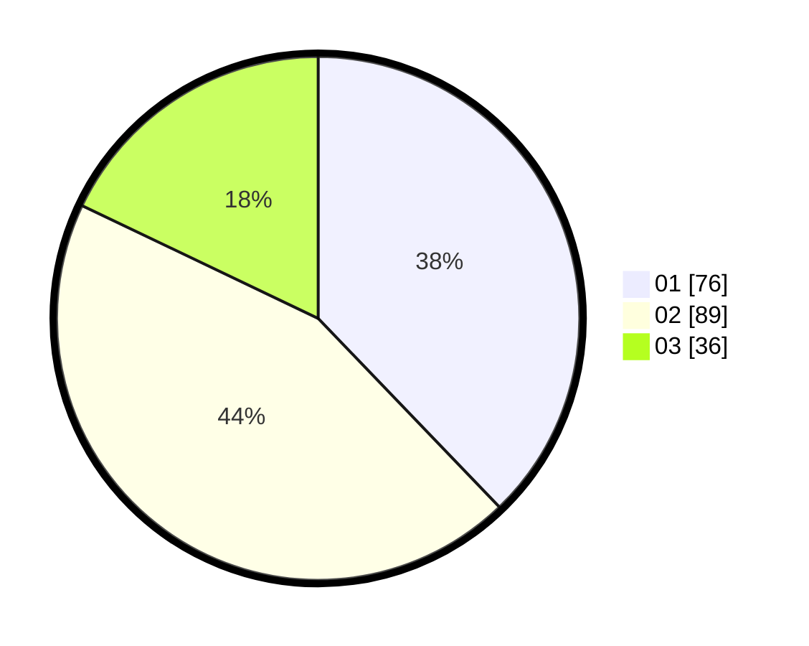

# Hasil

Hasil perolehan suara paslon dapat dilihat pada file paslon-01.txt, paslon-02.txt, dan paslon-03.txt.

Jika tidak ada, artinya data tersebut belum ada pada SIREKAP.

## Perolehan Suara

 * Paslon 01: **76**.
 * Paslon 02: **89**.
 * Paslon 03: **36**.

## Foto C Plano

https://sirekap-obj-formc.kpu.go.id/6095/pemilu/ppwp/31/71/03/10/04/3171031004074-20240216-101830--f15b01bd-34fc-471d-bf97-5cf01304ac85.jpg

https://sirekap-obj-formc.kpu.go.id/6095/pemilu/ppwp/31/71/03/10/04/3171031004074-20240216-092407--e54c9576-4ac5-4ec2-a378-68fb73192c42.jpg

https://sirekap-obj-formc.kpu.go.id/6095/pemilu/ppwp/31/71/03/10/04/3171031004074-20240216-093346--9b0011ff-9d25-43e8-8e7c-193b58cbbec5.jpg

## DATA PEMILIH TETAP

Jumlah pemilih dalam DPT: **279**.
 * L: **133**.
 * P: **146**.

## DATA PENGGUNA HAK PILIH

Jumlah pengguna hak pilih dalam DPT: **203**.
 * L: **90**.
 * P: **113**.

Jumlah pengguna hak pilih dalam DPTb: **0**.
 * L: **0**.
 * P: **0**.

Jumlah pengguna hak pilih dalam DPK: **1**.
 * L: **1**.
 * P: **0**.

Jumlah pengguna hak pilih: **204**.
 * L: **91**.
 * P: **113**.

## JUMLAH SUARA SAH DAN TIDAK SAH

JUMLAH SELURUH SUARA SAH: **201**.

JUMLAH SUARA TIDAK SAH: **3**.

JUMLAH SELURUH SUARA SAH DAN SUARA TIDAK SAH: **204**.
