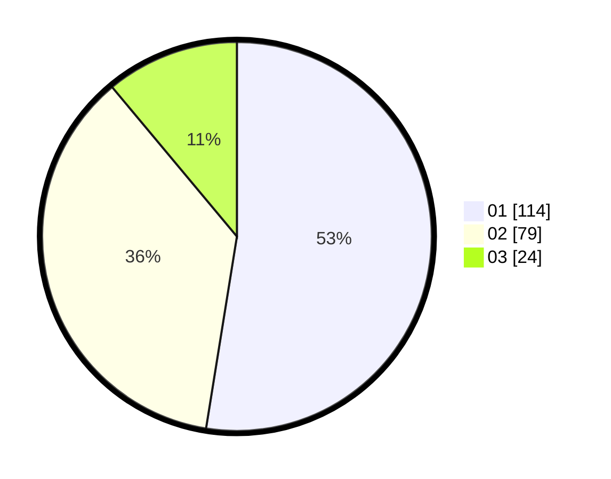

# Hasil

Hasil perolehan suara paslon dapat dilihat pada file paslon-01.txt, paslon-02.txt, dan paslon-03.txt.

Jika tidak ada, artinya data tersebut belum ada pada SIREKAP.

## Perolehan Suara

 * Paslon 01: **114**.
 * Paslon 02: **79**.
 * Paslon 03: **24**.

## Foto C Plano

https://sirekap-obj-formc.kpu.go.id/ee5d/pemilu/ppwp/31/71/03/10/04/3171031004078-20240214-185245--d0500ee5-5b85-4fa2-a1e9-4bd650941408.jpg

https://sirekap-obj-formc.kpu.go.id/ee5d/pemilu/ppwp/31/71/03/10/04/3171031004078-20240214-185251--2aad23cd-06d1-4aa8-a0d0-b4e13ba35bb8.jpg

https://sirekap-obj-formc.kpu.go.id/ee5d/pemilu/ppwp/31/71/03/10/04/3171031004078-20240215-064832--f98770ec-13d2-44ea-a9c1-ad6f6988145c.jpg

## DATA PEMILIH TETAP

Jumlah pemilih dalam DPT: **279**.
 * L: **137**.
 * P: **142**.

## DATA PENGGUNA HAK PILIH

Jumlah pengguna hak pilih dalam DPT: **212**.
 * L: **100**.
 * P: **112**.

Jumlah pengguna hak pilih dalam DPTb: **6**.
 * L: **3**.
 * P: **3**.

Jumlah pengguna hak pilih dalam DPK: **2**.
 * L: **2**.
 * P: **0**.

Jumlah pengguna hak pilih: **220**.
 * L: **105**.
 * P: **115**.

## JUMLAH SUARA SAH DAN TIDAK SAH

JUMLAH SELURUH SUARA SAH: **217**.

JUMLAH SUARA TIDAK SAH: **3**.

JUMLAH SELURUH SUARA SAH DAN SUARA TIDAK SAH: **220**.
