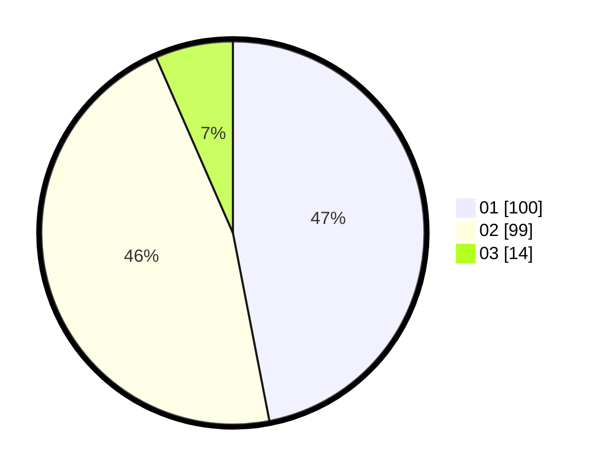

# Hasil

Hasil perolehan suara paslon dapat dilihat pada file paslon-01.txt, paslon-02.txt, dan paslon-03.txt.

Jika tidak ada, artinya data tersebut belum ada pada SIREKAP.

## Perolehan Suara

 * Paslon 01: **100**.
 * Paslon 02: **99**.
 * Paslon 03: **14**.

## Foto C Plano

https://sirekap-obj-formc.kpu.go.id/b54f/pemilu/ppwp/31/71/03/10/04/3171031004083-20240215-215857--3fca2d61-9431-4746-8322-fd12ba7a6c13.jpg

https://sirekap-obj-formc.kpu.go.id/b54f/pemilu/ppwp/31/71/03/10/04/3171031004083-20240215-215859--45efdde1-1e6c-4d61-a89c-e734bfa4277d.jpg

https://sirekap-obj-formc.kpu.go.id/b54f/pemilu/ppwp/31/71/03/10/04/3171031004083-20240215-215858--207138cc-10d4-45b4-95d4-374a0086de41.jpg

## DATA PEMILIH TETAP

Jumlah pemilih dalam DPT: **281**.
 * L: **129**.
 * P: **152**.

## DATA PENGGUNA HAK PILIH

Jumlah pengguna hak pilih dalam DPT: **216**.
 * L: **120**.
 * P: **96**.

Jumlah pengguna hak pilih dalam DPTb: **1**.
 * L: **0**.
 * P: **1**.

Jumlah pengguna hak pilih dalam DPK: **0**.
 * L: **0**.
 * P: **0**.

Jumlah pengguna hak pilih: **217**.
 * L: **120**.
 * P: **97**.

## JUMLAH SUARA SAH DAN TIDAK SAH

JUMLAH SELURUH SUARA SAH: **213**.

JUMLAH SUARA TIDAK SAH: **4**.

JUMLAH SELURUH SUARA SAH DAN SUARA TIDAK SAH: **217**.
