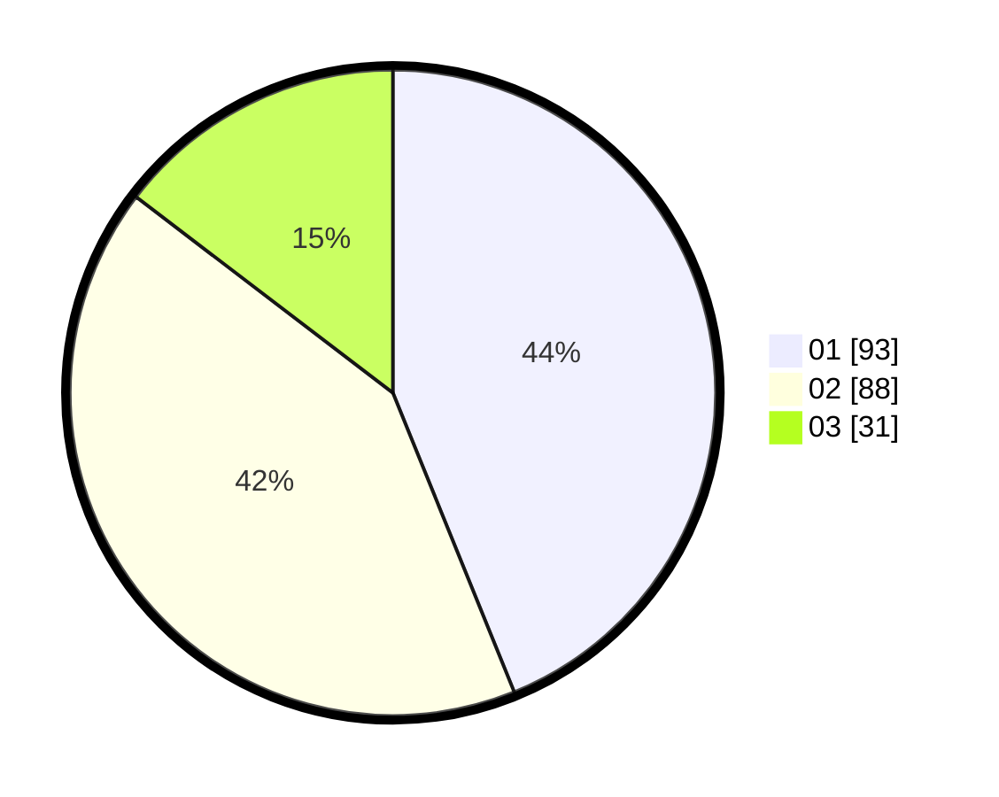

# Hasil

Hasil perolehan suara paslon dapat dilihat pada file paslon-01.txt, paslon-02.txt, dan paslon-03.txt.

Jika tidak ada, artinya data tersebut belum ada pada SIREKAP.

## Perolehan Suara

 * Paslon 01: **93**.
 * Paslon 02: **88**.
 * Paslon 03: **31**.

## Foto C Plano

https://sirekap-obj-formc.kpu.go.id/5813/pemilu/ppwp/31/71/03/10/04/3171031004087-20240215-000349--19cc21cd-d202-4c70-b8c0-9853d2389407.jpg

https://sirekap-obj-formc.kpu.go.id/5813/pemilu/ppwp/31/71/03/10/04/3171031004087-20240215-000605--9d01ea65-7ab8-49ff-9bfe-aafa89fdafde.jpg

https://sirekap-obj-formc.kpu.go.id/5813/pemilu/ppwp/31/71/03/10/04/3171031004087-20240214-211052--f40b9e99-7c6d-4eb1-bc9d-11f4ba39281c.jpg
