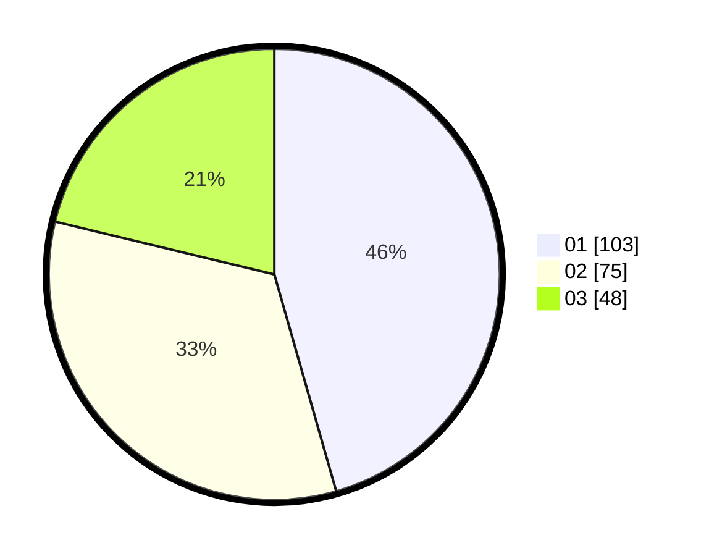

# Hasil

Hasil perolehan suara paslon dapat dilihat pada file paslon-01.txt, paslon-02.txt, dan paslon-03.txt.

Jika tidak ada, artinya data tersebut belum ada pada SIREKAP.

## Perolehan Suara

 * Paslon 01: **103**.
 * Paslon 02: **75**.
 * Paslon 03: **48**.

## Foto C Plano

https://sirekap-obj-formc.kpu.go.id/b4a1/pemilu/ppwp/31/71/03/10/04/3171031004091-20240214-201452--a07d37c1-2dd3-47c9-a9b2-f8af1602867d.jpg

https://sirekap-obj-formc.kpu.go.id/b4a1/pemilu/ppwp/31/71/03/10/04/3171031004091-20240214-201815--ada9d0c4-31ef-4d02-9508-84752ab86716.jpg

https://sirekap-obj-formc.kpu.go.id/b4a1/pemilu/ppwp/31/71/03/10/04/3171031004091-20240214-201608--7d13fbd9-4e6a-4cf3-adfa-6a362f648025.jpg

## DATA PEMILIH TETAP

Jumlah pemilih dalam DPT: **283**.
 * L: **136**.
 * P: **147**.

## DATA PENGGUNA HAK PILIH

Jumlah pengguna hak pilih dalam DPT: **229**.
 * L: **110**.
 * P: **119**.

Jumlah pengguna hak pilih dalam DPTb: **0**.
 * L: **0**.
 * P: **0**.

Jumlah pengguna hak pilih dalam DPK: **2**.
 * L: **1**.
 * P: **1**.

Jumlah pengguna hak pilih: **231**.
 * L: **111**.
 * P: **120**.

## JUMLAH SUARA SAH DAN TIDAK SAH

JUMLAH SELURUH SUARA SAH: **226**.

JUMLAH SUARA TIDAK SAH: **5**.

JUMLAH SELURUH SUARA SAH DAN SUARA TIDAK SAH: **231**.
