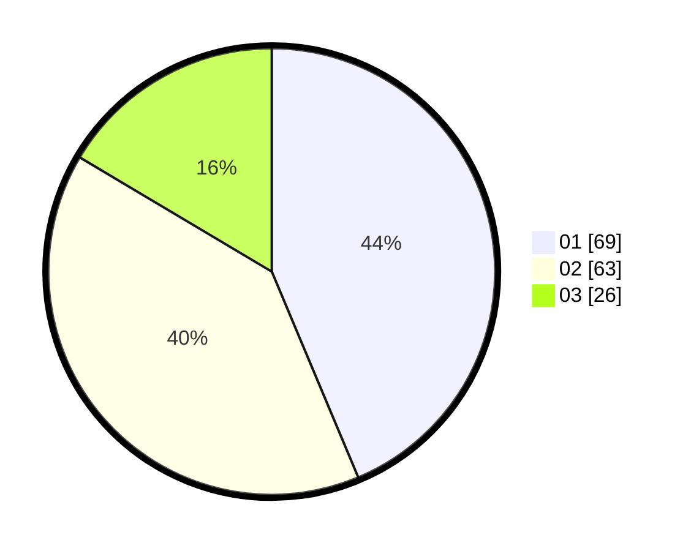

# Hasil

Hasil perolehan suara paslon dapat dilihat pada file paslon-01.txt, paslon-02.txt, dan paslon-03.txt.

Jika tidak ada, artinya data tersebut belum ada pada SIREKAP.

## Perolehan Suara

 * Paslon 01: **69**.
 * Paslon 02: **63**.
 * Paslon 03: **26**.

## Foto C Plano

https://sirekap-obj-formc.kpu.go.id/e522/pemilu/ppwp/31/71/03/10/04/3171031004100-20240215-021401--cd28b9fd-ccad-4c1d-9b1d-4ea20d0780f0.jpg

https://sirekap-obj-formc.kpu.go.id/e522/pemilu/ppwp/31/71/03/10/04/3171031004100-20240215-021539--9024038f-38e2-4b17-a254-e75c1d5a996f.jpg

https://sirekap-obj-formc.kpu.go.id/e522/pemilu/ppwp/31/71/03/10/04/3171031004100-20240215-021719--f23b3b2d-1272-4027-95a4-225fd0316925.jpg
