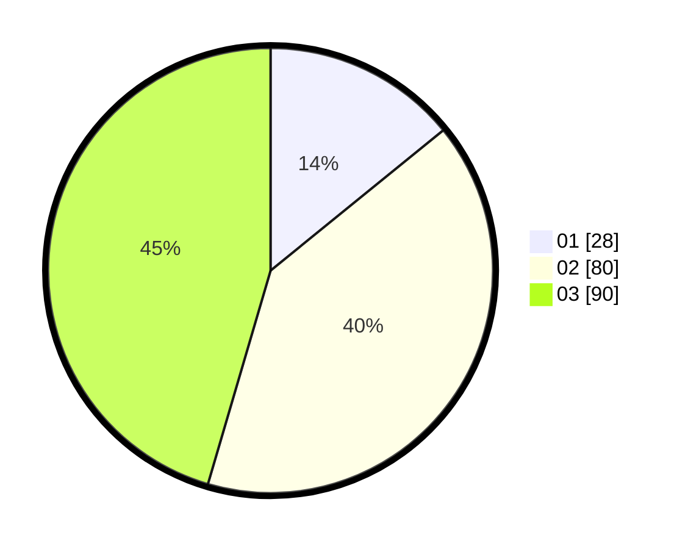

# Hasil

Hasil perolehan suara paslon dapat dilihat pada file paslon-01.txt, paslon-02.txt, dan paslon-03.txt.

Jika tidak ada, artinya data tersebut belum ada pada SIREKAP.

## Perolehan Suara

 * Paslon 01: **28**.
 * Paslon 02: **80**.
 * Paslon 03: **90**.

## Foto C Plano

https://sirekap-obj-formc.kpu.go.id/9573/pemilu/ppwp/31/71/03/10/05/3171031005001-20240216-134906--61508b65-526f-40fd-826c-b951c1b10236.jpg

https://sirekap-obj-formc.kpu.go.id/9573/pemilu/ppwp/31/71/03/10/05/3171031005001-20240216-134907--2197dc74-b22a-4d96-aa55-6b638c619f89.jpg

https://sirekap-obj-formc.kpu.go.id/9573/pemilu/ppwp/31/71/03/10/05/3171031005001-20240216-134906--edcff328-9ce1-4be8-8944-64b21b8da9f6.jpg

## DATA PEMILIH TETAP

Jumlah pemilih dalam DPT: **257**.
 * L: **124**.
 * P: **133**.

## DATA PENGGUNA HAK PILIH

Jumlah pengguna hak pilih dalam DPT: **182**.
 * L: **91**.
 * P: **91**.

Jumlah pengguna hak pilih dalam DPTb: **15**.
 * L: **7**.
 * P: **8**.

Jumlah pengguna hak pilih dalam DPK: **1**.
 * L: **0**.
 * P: **1**.

Jumlah pengguna hak pilih: **198**.
 * L: **98**.
 * P: **100**.

## JUMLAH SUARA SAH DAN TIDAK SAH

JUMLAH SELURUH SUARA SAH: **198**.

JUMLAH SUARA TIDAK SAH: **0**.

JUMLAH SELURUH SUARA SAH DAN SUARA TIDAK SAH: **198**.
