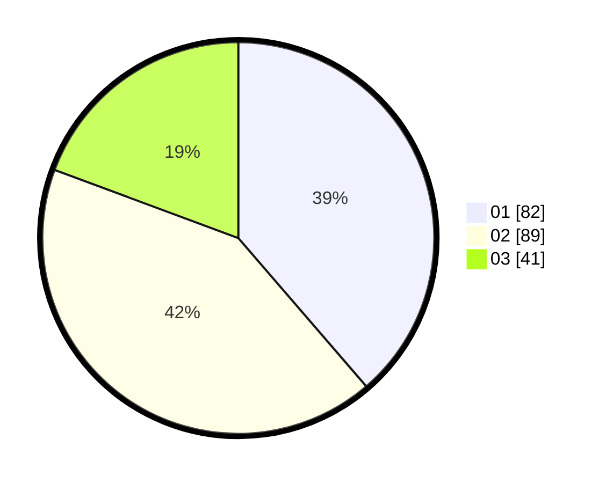

# Hasil

Hasil perolehan suara paslon dapat dilihat pada file paslon-01.txt, paslon-02.txt, dan paslon-03.txt.

Jika tidak ada, artinya data tersebut belum ada pada SIREKAP.

## Perolehan Suara

 * Paslon 01: **82**.
 * Paslon 02: **89**.
 * Paslon 03: **41**.

## Foto C Plano

https://sirekap-obj-formc.kpu.go.id/6aee/pemilu/ppwp/31/71/03/10/05/3171031005007-20240216-082909--77ffd5a6-4191-4002-9ad8-81124d9fc18f.jpg

https://sirekap-obj-formc.kpu.go.id/6aee/pemilu/ppwp/31/71/03/10/05/3171031005007-20240216-082913--4a9b57b7-d23d-44c3-b39a-a544202776df.jpg

https://sirekap-obj-formc.kpu.go.id/6aee/pemilu/ppwp/31/71/03/10/05/3171031005007-20240216-082910--c59b88fc-25ad-48cf-8b83-06e97a92a002.jpg

## DATA PEMILIH TETAP

Jumlah pemilih dalam DPT: **271**.
 * L: **137**.
 * P: **134**.

## DATA PENGGUNA HAK PILIH

Jumlah pengguna hak pilih dalam DPT: **200**.
 * L: **99**.
 * P: **101**.

Jumlah pengguna hak pilih dalam DPTb: **13**.
 * L: **11**.
 * P: **2**.

Jumlah pengguna hak pilih dalam DPK: **0**.
 * L: **0**.
 * P: **0**.

Jumlah pengguna hak pilih: **213**.
 * L: **110**.
 * P: **103**.

## JUMLAH SUARA SAH DAN TIDAK SAH

JUMLAH SELURUH SUARA SAH: **212**.

JUMLAH SUARA TIDAK SAH: **4**.

JUMLAH SELURUH SUARA SAH DAN SUARA TIDAK SAH: **216**.
