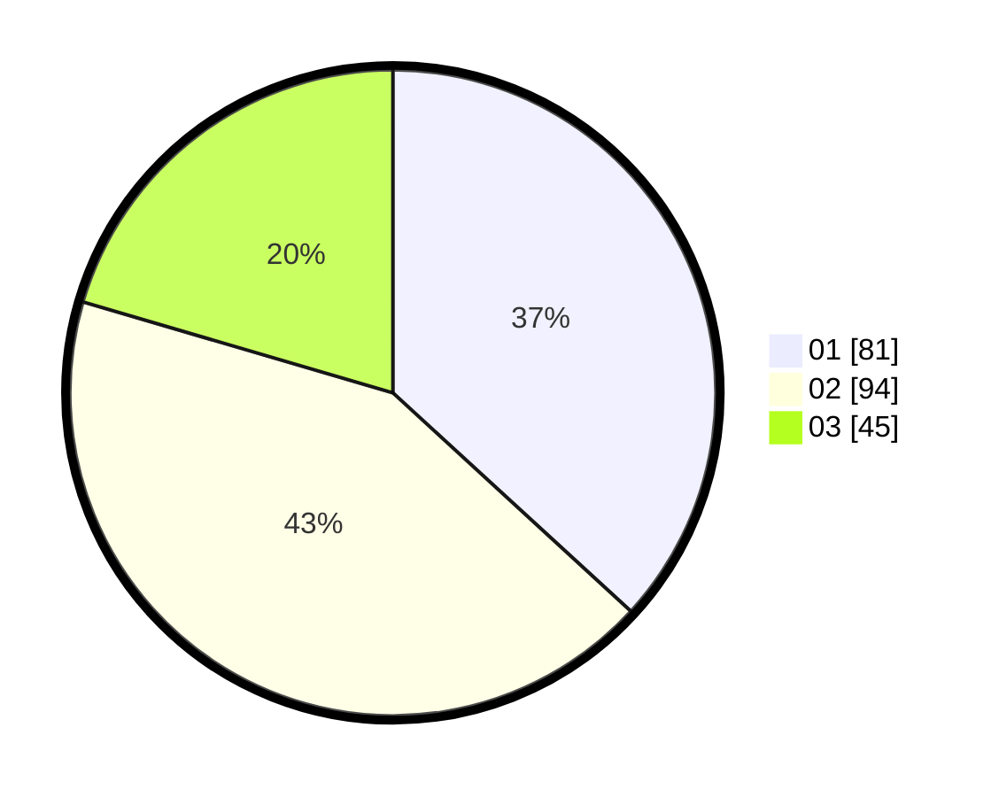

# Hasil

Hasil perolehan suara paslon dapat dilihat pada file paslon-01.txt, paslon-02.txt, dan paslon-03.txt.

Jika tidak ada, artinya data tersebut belum ada pada SIREKAP.

## Perolehan Suara

 * Paslon 01: **81**.
 * Paslon 02: **94**.
 * Paslon 03: **45**.

## Foto C Plano

https://sirekap-obj-formc.kpu.go.id/ff8c/pemilu/ppwp/31/71/03/10/05/3171031005008-20240214-233817--cf9b4731-2adf-415f-a509-69fe60011cd9.jpg

https://sirekap-obj-formc.kpu.go.id/ff8c/pemilu/ppwp/31/71/03/10/05/3171031005008-20240215-040329--ac15c734-6e61-4b31-909c-43ea316cc5b4.jpg

https://sirekap-obj-formc.kpu.go.id/ff8c/pemilu/ppwp/31/71/03/10/05/3171031005008-20240215-040454--b9e7df18-8004-4198-94f7-6a50c6465622.jpg
