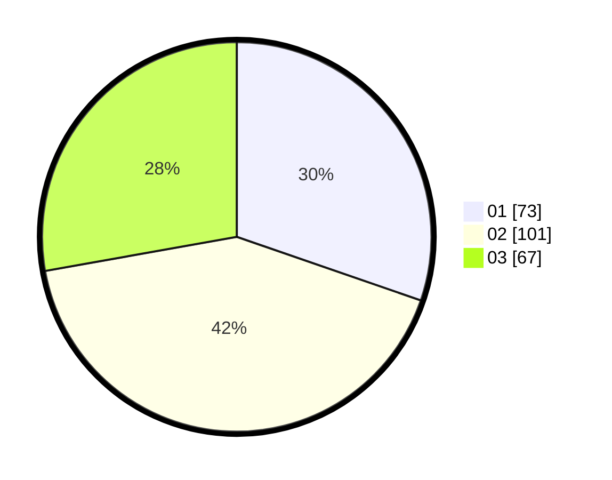

# Hasil

Hasil perolehan suara paslon dapat dilihat pada file paslon-01.txt, paslon-02.txt, dan paslon-03.txt.

Jika tidak ada, artinya data tersebut belum ada pada SIREKAP.

## Perolehan Suara

 * Paslon 01: **73**.
 * Paslon 02: **101**.
 * Paslon 03: **67**.

## Foto C Plano

https://sirekap-obj-formc.kpu.go.id/0425/pemilu/ppwp/31/71/03/10/05/3171031005009-20240217-185404--e1d8a3d0-f4d6-4f79-aa14-36bebd4a0515.jpg

https://sirekap-obj-formc.kpu.go.id/0425/pemilu/ppwp/31/71/03/10/05/3171031005009-20240217-185406--6b87a144-0a14-420e-8502-0a9a6fdd70c6.jpg

https://sirekap-obj-formc.kpu.go.id/0425/pemilu/ppwp/31/71/03/10/05/3171031005009-20240217-185405--6efe3e5f-f5db-4f9e-a8d4-80e4a021ec33.jpg

## DATA PEMILIH TETAP

Jumlah pemilih dalam DPT: **288**.
 * L: **142**.
 * P: **146**.

## DATA PENGGUNA HAK PILIH

Jumlah pengguna hak pilih dalam DPT: **222**.
 * L: **105**.
 * P: **117**.

Jumlah pengguna hak pilih dalam DPTb: **19**.
 * L: **7**.
 * P: **12**.

Jumlah pengguna hak pilih dalam DPK: **1**.
 * L: **0**.
 * P: **1**.

Jumlah pengguna hak pilih: **242**.
 * L: **112**.
 * P: **130**.

## JUMLAH SUARA SAH DAN TIDAK SAH

JUMLAH SELURUH SUARA SAH: **241**.

JUMLAH SUARA TIDAK SAH: **1**.

JUMLAH SELURUH SUARA SAH DAN SUARA TIDAK SAH: **242**.
