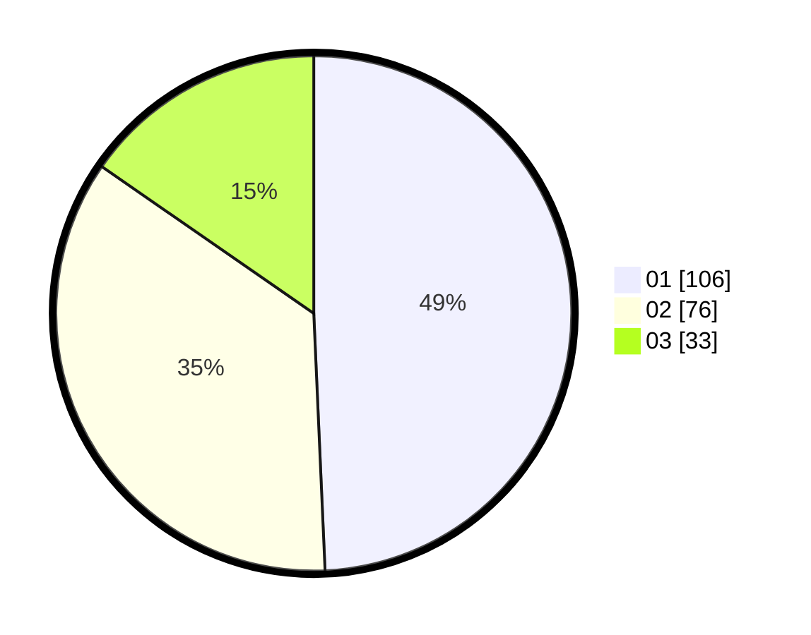

# Hasil

Hasil perolehan suara paslon dapat dilihat pada file paslon-01.txt, paslon-02.txt, dan paslon-03.txt.

Jika tidak ada, artinya data tersebut belum ada pada SIREKAP.

## Perolehan Suara

 * Paslon 01: **106**.
 * Paslon 02: **76**.
 * Paslon 03: **33**.

## Foto C Plano

https://sirekap-obj-formc.kpu.go.id/c222/pemilu/ppwp/31/71/03/10/05/3171031005012-20240215-210530--dc3d6f5f-e77d-4e11-a0f2-699f07a4037c.jpg

https://sirekap-obj-formc.kpu.go.id/c222/pemilu/ppwp/31/71/03/10/05/3171031005012-20240215-210536--1e457a91-3e67-493f-aa4e-ec675de58008.jpg

https://sirekap-obj-formc.kpu.go.id/c222/pemilu/ppwp/31/71/03/10/05/3171031005012-20240215-210534--6dec2642-01e9-4cb7-baa2-6362478a43d5.jpg

## DATA PEMILIH TETAP

Jumlah pemilih dalam DPT: **259**.
 * L: **124**.
 * P: **135**.

## DATA PENGGUNA HAK PILIH

Jumlah pengguna hak pilih dalam DPT: **195**.
 * L: **94**.
 * P: **101**.

Jumlah pengguna hak pilih dalam DPTb: **18**.
 * L: **8**.
 * P: **10**.

Jumlah pengguna hak pilih dalam DPK: **3**.
 * L: **1**.
 * P: **2**.

Jumlah pengguna hak pilih: **216**.
 * L: **103**.
 * P: **113**.

## JUMLAH SUARA SAH DAN TIDAK SAH

JUMLAH SELURUH SUARA SAH: **215**.

JUMLAH SUARA TIDAK SAH: **1**.

JUMLAH SELURUH SUARA SAH DAN SUARA TIDAK SAH: **216**.
